# Modelo de dados do Timenow GestNow

> **Modelo completo (partes 1 e 2).** A parte 1 desenhou a plataforma, os
> cadastros de apoio, a **01 Central de Ações**, a **08 Governança** e o
> **03 Financeiro**. Esta parte 2 completa o diagrama com **02 Planejamento**,
> **02 Programação Semanal**, **04 Suprimentos**, **05 Riscos**, **06
> Qualidade**, **07 HSE**, a análise do período e o relatório gerencial, e
> fecha a cobertura de todos os mocks e do repositório JSON do app de
> Programação Semanal.
>
> Estado: **aceito para execução** (decisão Q30). O dono do produto revisa o
> modelo no fim da execução; mudança depois disso vira issue nova.
>
> Regras da spec: D5 (uma tabela por entidade, nomes em português snake_case,
> chaves estrangeiras e restrições no banco, `projeto_id` em todo registro de
> projeto, `versao` em todo registro editável, centavos inteiros e datas em
> `date`), D5a (anexos), D5b (somente fatos, com exceções históricas), D7
> (colaborador, perfis e vínculo), D8 (escopo de projeto e Portfólio) e D10
> (a Programação Semanal segue o app, com o "ambiente" virando `projeto_id`).
> Histórias atendidas: HU-152 e HU-154.

## Como ler este documento

* Os diagramas estão em **Mermaid** e renderizam no próprio Markdown. Cada
  entidade traz as colunas com **PK** (chave primária), **FK** (chave
  estrangeira) e **UK** (chave única). A cardinalidade segue a notação
  `||--o{` (um para muitos), `||--o|` (um para zero ou um) e `|o--o{` (zero ou
  um para muitos).
* Todas as entidades do modelo estão desenhadas aqui. A seção
  [Ligações entre módulos](#ligações-entre-módulos) mostra as relações que
  cruzam módulos, separando as chaves estrangeiras das referências por código
  resolvidas pela plataforma (D9).
* Depois dos diagramas, a seção [Tabelas](#tabelas) tem **uma linha por
  tabela** com o que ela guarda e o **módulo dono**. No fim estão a
  [Tabela de cobertura dos mocks](#tabela-de-cobertura-dos-mocks) e a
  [Tabela de cobertura do repositório JSON](#tabela-de-cobertura-do-repositório-json-do-app),
  que mapeiam 100% das coleções e das chaves.

## Regras do desenho

1. **Uma tabela por entidade.** Nome de tabela e de coluna em português,
   snake_case, igual ao glossário do `CONTEXT.md` (`acao`, `medicao`,
   `projeto_id`, `data_prevista`).
2. **Chaves estrangeiras e restrições no banco.** Toda ligação desenhada tem
   FK e as unicidades de negócio estão anotadas (UK).
3. **`projeto_id` em todo registro de projeto.** Toda tabela com chave própria
   ligada a um projeto carrega `projeto_id`. Tabelas-filhas de um agregado
   (replanejamentos, participantes, itens do impacto, movimentos da reserva,
   notas da avaliação, etapas do pacote, dias da atividade, itens do
   checklist, pontos do ITP, desvios da análise) não repetem a coluna: o
   projeto é o da raiz do agregado. `analise_periodo` aceita `projeto_id`
   nulo: é a análise do Portfólio (D8).
4. **`versao` em todo registro editável.** Tabelas com tela de edição ou com
   mudança de situação carregam `versao` (controle de edição simultânea da D5,
   recusa com 409). Ficam sem `versao`:
   * `auditoria` — tabela só de inclusão;
   * `parametro_versao`, `parametro_valor` e `portfolio_ponderacao` — cada
     alteração cria uma versão nova, nada é editado;
   * os fatos imutáveis de histórico, parte 1: `acao_replanejamento`,
     `eac_revisao_item`, `eac_remanejamento`, `eac_projecao`, `custo_erp`,
     `reserva_movimento`, `curva_financeira_revisao`, `curva_financeira_mes`,
     `contrato_aditivo`, `licao_palavra_chave`, `licao_aplicacao`,
     `mudanca_impacto_eac_item`, `mudanca_remanejamento` e
     `mudanca_decisao_participante`;
   * os fatos imutáveis de histórico, parte 2: `eap_medicao`,
     `eap_revisao_item`, `eap_desdobramento`, `curva_fisica_revisao`,
     `curva_fisica_mes`, `produtividade_revisao`, `produtividade_distribuicao`,
     `produtividade_apontamento`, `amostragem_motivo`, `processo_negociacao`,
     `fornecedor_historico`, `risco_avaliacao`, `risco_revisao`,
     `risco_plano_aprovacao`, `auditoria_reprogramacao` e
     `ocorrencia_investigacao`;
   * as tabelas-filhas do agregado editáveis em conjunto (`ata_empresa`,
     `ata_participante`, `contrato_avaliacao_criterio`, `eap_item_etapa`,
     `relato_atividade`, `relato_ponto`, `lookahead_semana`,
     `programacao_dia`, `programacao_janela_dia`,
     `programacao_janela_semana`, `programacao_liberacao_extra`,
     `hse_inspecao_item`, `itp_revisao`, `itp_ponto`,
     `auditoria_constatacao`, `analise_risco_participante` e
     `analise_periodo_desvio`), protegidas pela `versao` da raiz.
5. **Somente fatos (D5b).** Nenhum indicador derivado vira coluna. Exceções
   históricas da D5b, anotadas na
   [seção própria](#exceções-da-d5b-gravadas): linha de base congelada de cada
   revisão da EAP, da EAC, da Curva S física, da Curva S financeira e das
   quantidades da produtividade; os pesos gravados na avaliação de contratada;
   e o prazo vigente gravado na ocorrência HSE.
6. **Centavos inteiros e datas em `date`.** Todo valor financeiro é `bigint` em
   centavos; datas sem hora são `date`; carimbos técnicos são `timestamptz`.
7. **Módulo dono.** Um módulo lê ou grava tabela de outro somente pela fachada
   do dono (`service.py`), nunca direto (D5, D9).

## Diagramas

### 1. Plataforma e cadastros de apoio

### 2. 01 Central de Ações

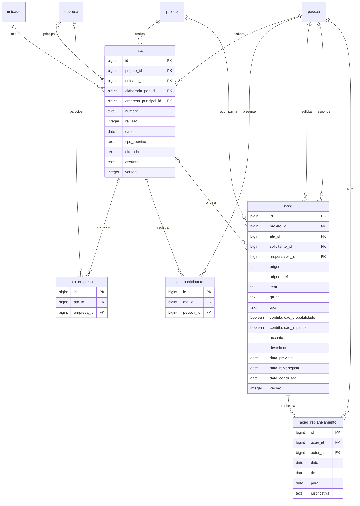

### 3. 08 Governança

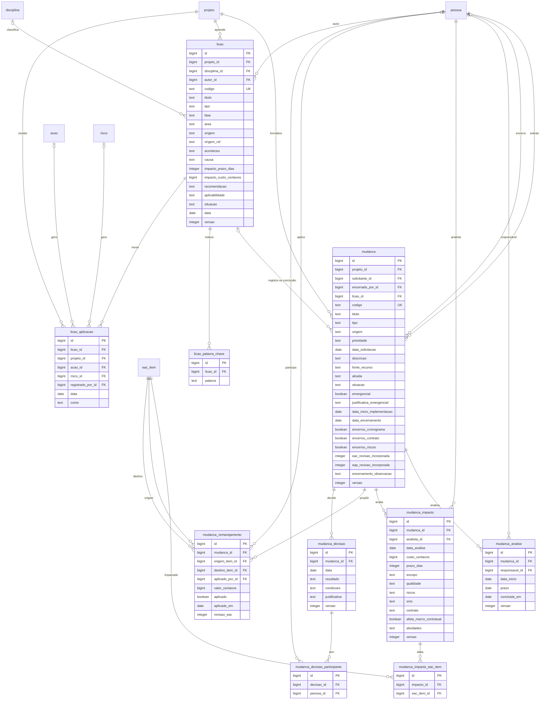

### 4. 03 Financeiro: EAC, reservas e curva financeira

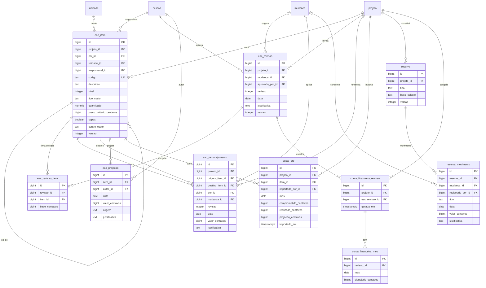

### 5. 03 Financeiro: contratos

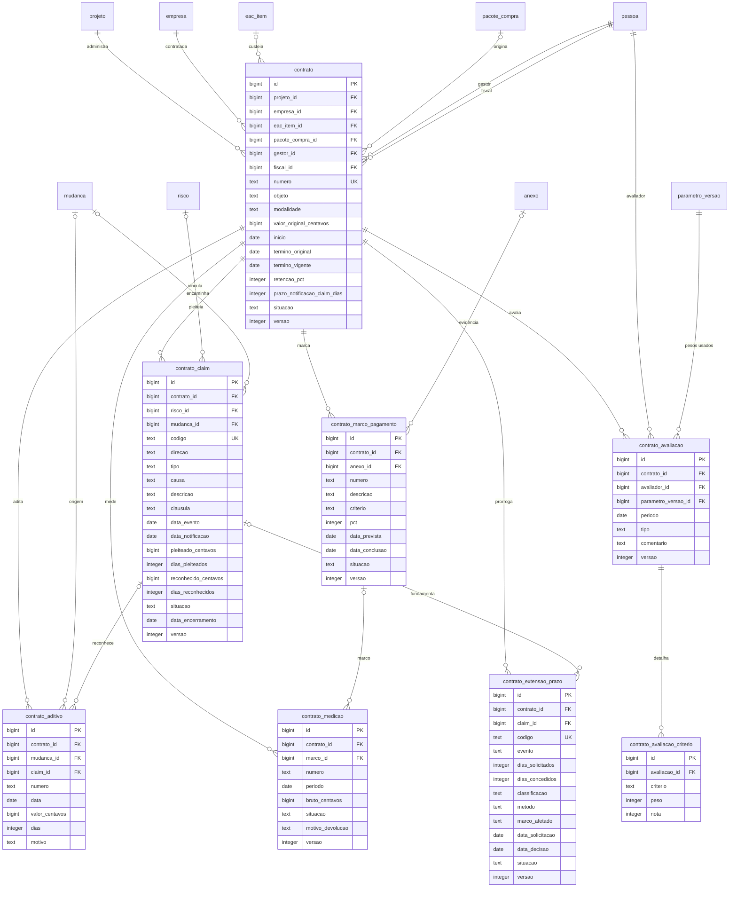

### 6. 02 Planejamento: EAP, curva física, relato, 6WLA e punch list

```mermaid
erDiagram
    projeto ||--o{ eap_item : "decompõe"
    eap_item ||--o{ eap_item : "pai de"
    eac_item |o--o{ eap_item : "espelha custo"
    unidade |o--o{ eap_item : "mede"
    empresa |o--o{ eap_item : "executa"
    pessoa |o--o{ eap_item : "responde"
    eap_item ||--o{ eap_item_etapa : "detalha etapas"
    eap_item ||--o{ eap_medicao : "mede"
    pessoa ||--o{ eap_medicao : "autor"
    projeto ||--o{ eap_revisao : "revisa"
    mudanca |o--o{ eap_revisao : "origem"
    pessoa ||--o{ eap_revisao : "aprova"
    eap_revisao ||--o{ eap_revisao_item : "congela"
    eap_item ||--o{ eap_revisao_item : "linha de base"
    projeto ||--o{ eap_desdobramento : "desdobra"
    eap_item ||--o{ eap_desdobramento : "origem"
    eap_item ||--o{ eap_desdobramento : "destino"
    pessoa ||--o{ eap_desdobramento : "autor"
    projeto ||--o{ curva_fisica_revisao : "congela"
    eap_revisao ||--o{ curva_fisica_revisao : "espelha"
    curva_fisica_revisao ||--o{ curva_fisica_mes : "tem"
    projeto ||--o{ relato : "relata"
    pessoa ||--o{ relato : "escreve"
    relato ||--o{ relato_atividade : "lista"
    relato ||--o{ relato_ponto : "aponta"
    projeto ||--o{ lookahead : "prepara"
    empresa |o--o{ lookahead : "executa"
    pessoa |o--o{ lookahead : "responde"
    lookahead ||--o{ lookahead_semana : "semana"
    lookahead ||--o{ lookahead_restricao : "restringe"
    pessoa |o--o{ lookahead_restricao : "remove"
    projeto ||--o{ punch_item : "completa"
    sistema ||--o{ punch_item : "agrupa"
    empresa |o--o{ punch_item : "executa"
    pessoa ||--o{ punch_item : "responde"
    pessoa |o--o{ punch_item : "verifica"

    eap_item {
        bigint id PK
        bigint projeto_id FK
        bigint pai_id FK
        bigint eac_item_id FK
        bigint unidade_id FK
        bigint empresa_id FK
        bigint responsavel_id FK
        text codigo UK
        text descricao
        integer nivel
        text tipo
        text criterio
        text modelo
        numeric quantidade
        numeric peso
        numeric previsto
        date inicio
        date termino
        text entregavel
        text aceitacao
        integer versao
    }
    eap_item_etapa {
        bigint id PK
        bigint item_id FK
        integer ordem
        text nome
        numeric peso
    }
    eap_medicao {
        bigint id PK
        bigint item_id FK
        bigint autor_id FK
        date data
        numeric de
        numeric para
        text observacao
    }
    eap_revisao {
        bigint id PK
        bigint projeto_id FK
        bigint mudanca_id FK
        bigint aprovado_por_id FK
        integer revisao
        date data
        text alteracao
        text justificativa
        integer versao
    }
    eap_revisao_item {
        bigint id PK
        bigint revisao_id FK
        bigint item_id FK
        numeric peso
    }
    eap_desdobramento {
        bigint id PK
        bigint projeto_id FK
        bigint origem_item_id FK
        bigint destino_item_id FK
        bigint por_id FK
        integer revisao
        date data
        numeric peso
        text justificativa
    }
    curva_fisica_revisao {
        bigint id PK
        bigint projeto_id FK
        bigint eap_revisao_id FK
        timestamptz gerada_em
    }
    curva_fisica_mes {
        bigint id PK
        bigint revisao_id FK
        date mes
        numeric baseline_pct
    }
    relato {
        bigint id PK
        bigint projeto_id FK
        bigint criado_por_id FK
        bigint atualizado_por_id FK
        text tipo
        text periodo
        timestamptz criado_em
        timestamptz atualizado_em
        integer versao
    }
    relato_atividade {
        bigint id PK
        bigint relato_id FK
        text grupo
        integer ordem
        text texto
    }
    relato_ponto {
        bigint id PK
        bigint relato_id FK
        integer ordem
        text descricao
        text natureza
        text risco
    }
    lookahead {
        bigint id PK
        bigint projeto_id FK
        bigint empresa_id FK
        bigint responsavel_id FK
        text codigo UK
        text atividade
        text area
        text disciplina
        integer versao
    }
    lookahead_semana {
        bigint id PK
        bigint lookahead_id FK
        integer indice
        boolean prevista
    }
    lookahead_restricao {
        bigint id PK
        bigint lookahead_id FK
        bigint responsavel_id FK
        integer ordem
        text tipo
        text descricao
        date necessaria
        date remocao
        integer versao
    }
    punch_item {
        bigint id PK
        bigint projeto_id FK
        bigint sistema_id FK
        bigint empresa_id FK
        bigint responsavel_id FK
        bigint identificado_por_id FK
        bigint verificado_por_id FK
        text codigo UK
        text subsistema
        text tag
        text disciplina
        text categoria
        text marco
        text origem
        text descricao
        date abertura
        date prazo
        date fechamento
        text situacao
        integer versao
    }
```

### 7. 02 Planejamento: produtividade

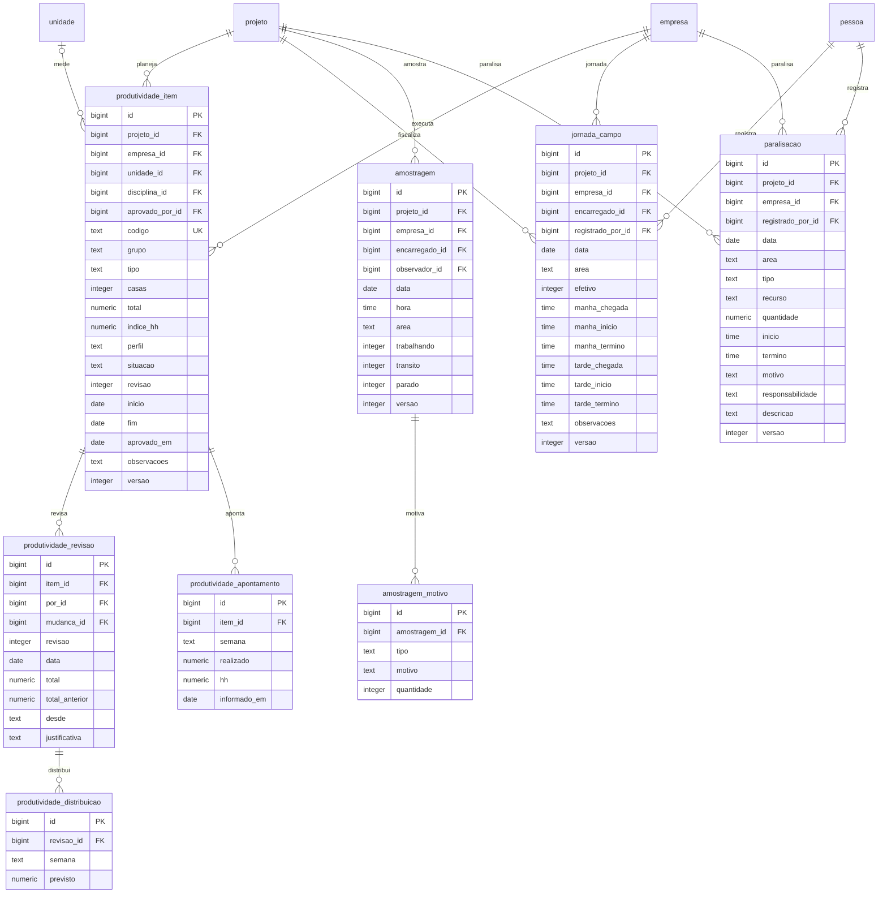

### 8. 02 Programação Semanal (o app portado, D10)

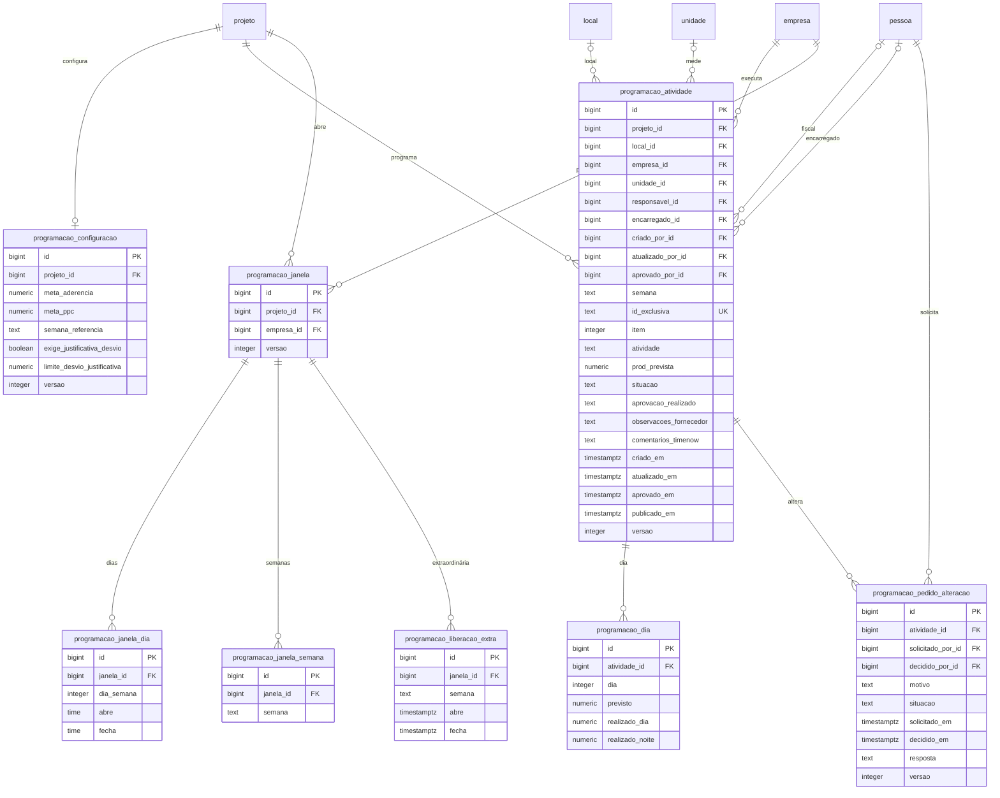

A semana é a do calendário único da plataforma (`S.30/2026`, ISSUE-007); o
formato `2026-S38` do mock é só de exibição. Os nomes de local, unidade, fiscal
e encarregado do app viram FKs para os cadastros e Colaboradores do GestNow
(D10); o total previsto, o total realizado, o PPC, a faixa e a aderência são
calculados.

### 9. 04 Suprimentos

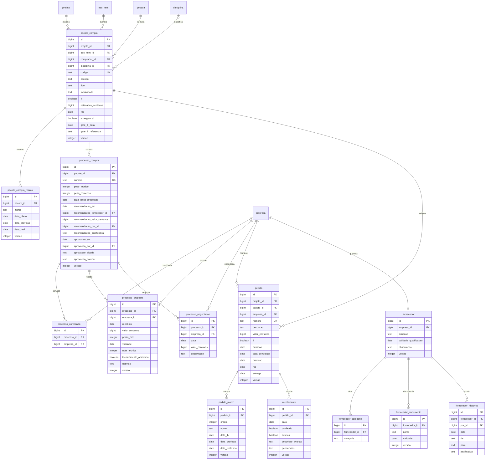

Os marcos de aquisição do pacote e os marcos de fabricação do pedido são as
duas metades do MAS (12 marcos); a folga (ROS − previsão), a situação do marco,
o avanço, a aderência, o saving e o OTD são calculados. As referências de
contrato e pedido do pacote (`contratoRef`, `pedidoRef`) vêm de
`contrato.pacote_compra_id` e `pedido.pacote_id`. O `historico` do processo é
lido da `auditoria`.

### 10. 05 Riscos

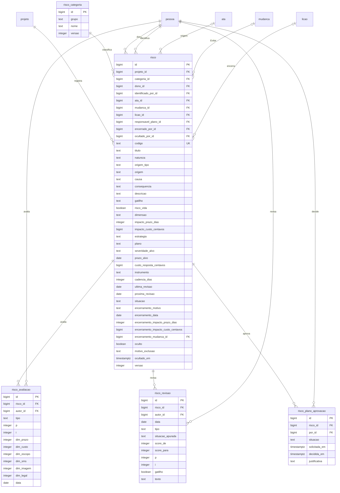

`responsavel_plano_id` é quem responde pelo plano de resposta e não pode
aprová-lo (segregação de funções, D7). A linha do tempo da ficha é composta de
`risco_avaliacao`, `risco_revisao` e `auditoria`; a evolução mensal do score
residual é reconstruída das avaliações e revisões (D6); score, severidade, VME
e exposição são calculados.

### 11. 06 Qualidade

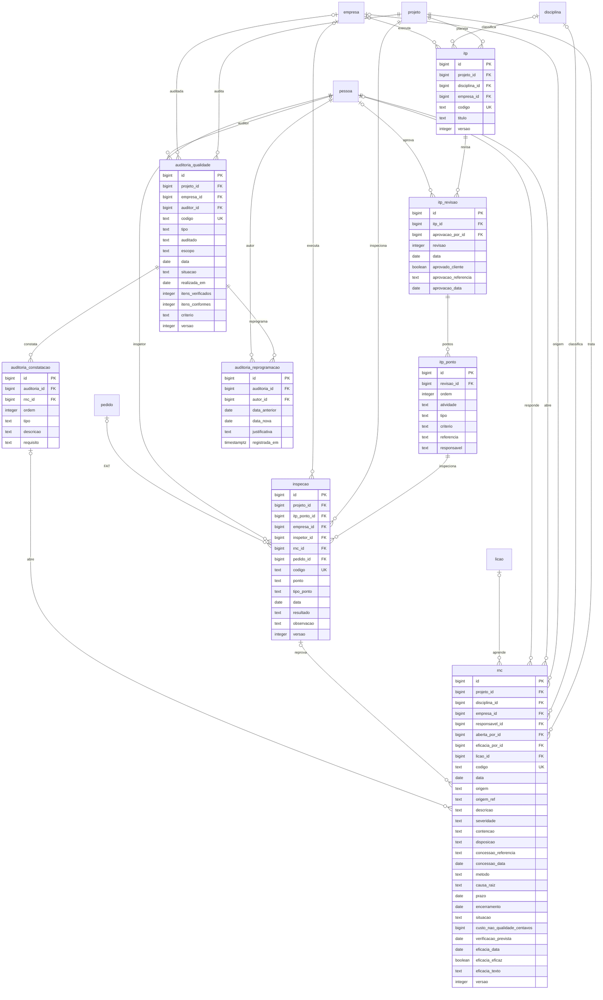

`auditoria_qualidade` tem nome próprio para não se confundir com `auditoria`
(trilha da plataforma). O ponto e o tipo do ponto ficam copiados na inspeção
como fato do momento; a reprovação abre a `rnc` na mesma transação e o FAT
gravado no diligenciamento aponta `pedido_id`.

### 12. 07 HSE

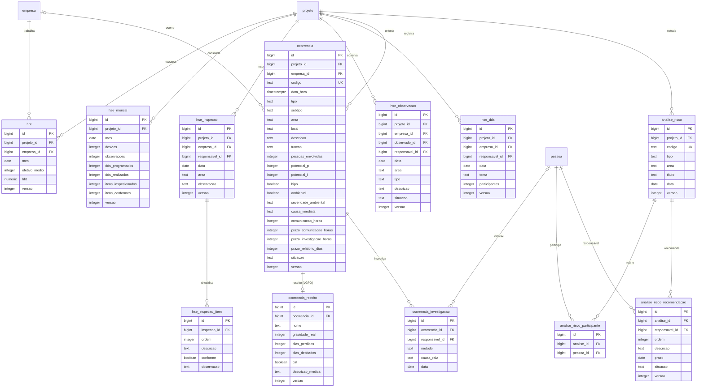

`ocorrencia_restrito` é a tabela de acesso restrito da LGPD (Q35): o Membro
preenche, mas só Gestor e Admin leem o nome e os dados médicos, e os anexos com
esses dados seguem a mesma permissão. O registro geral guarda função e número
de pessoas envolvidas, **sem nome**. Taxas, pirâmide, dias sem afastamento e
histograma são calculados dos fatos.

### 13. Análise do período e relatório

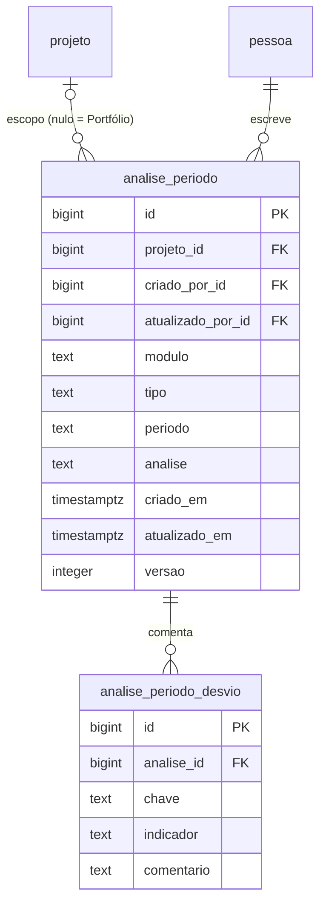

O **relatório gerencial** não tem tabela própria: o motor de corte monta as
folhas na emissão a partir de `relato`, de `analise_periodo` e dos fatos dos
módulos, e "Alterar período" recalcula. A análise é uma por módulo, tipo
(Semanal ou Mensal) e período; no Portfólio, `projeto_id` é nulo (D8). Os
desvios detectados são calculados; o comentário de cada um é o fato gravado em
`analise_periodo_desvio`, obrigatório para desvio negativo novo em 02, 03 e 04.

### 14. Ligações entre módulos

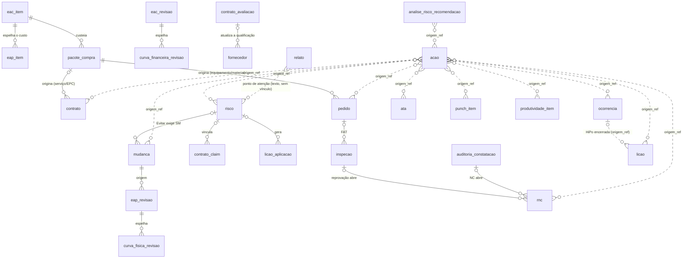

As linhas cheias são chaves estrangeiras; as pontilhadas são referências por
código (`origem` + `origem_ref`), resolvidas pela função de plataforma e
conferidas pela fachada do módulo dono dentro da transação (D9). A emissão de
um processo de compra gera **pedido** (equipamento e material) ou **contrato**
(serviço e EPC) pelo mesmo `pacote_compra`; por isso o contrato tem
`pacote_compra_id` e o pedido tem `pacote_id`. O risco sugerido do
diligenciamento, do claim e da lição aplicada (ISSUE-067) nasce por chamada de
fachada, não por coluna.

## Tabelas

### Plataforma e cadastros de apoio

| Tabela | O que guarda | Dono |
|---|---|---|
| `cliente` | Cliente do projeto (nome, sigla, ativo). | plataforma |
| `projeto` | Cadastro do projeto: código, nome, PEP, padrões de numeração (ata, risco, punch), gerente, apetite a risco, datas, orçamento aprovado em centavos. As notas da ponderação da carteira não ficam aqui: vão para `portfolio_ponderacao`. | configurações (cadastro), consumido por todos os módulos |
| `empresa` | Empresa contratada, fornecedor ou gerenciadora (nome e tipo). | configurações |
| `pessoa` | Pessoa do cadastro (nome, função, empresa e e-mail único de acesso). | configurações |
| `colaborador` | Pessoa com acesso: perfil geral (Visualizador, Membro, Gestor, Admin), vínculo (Timenow, Fornecedor, Cliente) e empresa (obrigatória no vínculo Fornecedor). O e-mail de acesso é `pessoa.email`. | configurações |
| `colaborador_papel_programacao` | Papel do colaborador na Programação Semanal por projeto (Planejador, Fiscal, Encarregado, Fornecedor); zero ou mais papéis por projeto. | configurações (cadastro), consumido por programação semanal |
| `parametro_versao` | Versão de um grupo de parâmetros: vigência, justificativa obrigatória, autor e data. Cada gravação cria uma versão; nada é editado. | configurações |
| `parametro_valor` | Valor de um parâmetro na versão, em linha tipada (`chave`, `tipo`, `valor`, `ordem` para listas). Cobre todos os grupos do protótipo (avaliação de contratadas, claims, HSE, riscos, financeiro, suprimentos, punch, mudanças, lições, produtividade, EAP, qualidade, portfólio). | configurações |
| `portfolio_ponderacao` | Nota de 1 a 5 de cada projeto por critério da carteira, dentro da versão de parâmetros do grupo portfólio; a edição da ponderação gera versão nova. | configurações |
| `sequencia_numeracao` | Próximo número por projeto e tipo (ata, SM, risco, RNC, punch, lição, claim, EOT...), com trava de linha na transação. | plataforma |
| `auditoria` | Trilha de auditoria **só de inclusão**: quem, quando, entidade, registro, ação e o antes/depois. Sem `versao`; a atualização e a exclusão são proibidas no banco. | plataforma |
| `anexo` | Metadados do arquivo (nome, tipo, tamanho, hash, autor, data) e o registro de origem (tabela + id). O arquivo fica na pasta local ou no Blob; o download checa a permissão do registro de origem (D5a). | plataforma |
| `notificacao` | Registro de envio (follow-up, pauta, tesouraria): destinatários, assunto, corpo, situação `simulado`/`enviado`/`erro` e referência ao registro. | plataforma |
| `sistema` | Cadastro de apoio de sistemas do projeto (código, nome, área); usado pelo punch list e pelas telas de planejamento. | configurações |
| `unidade` | Cadastro de apoio de unidades: de medida (m, un, Hh) ou organizacional (Unidade Horizonte), distinguidas por `tipo`. | configurações |
| `local` | Cadastro de apoio de locais do projeto (código, nome). | configurações |
| `disciplina` | Cadastro de apoio de disciplinas (Civil, Mecânica, Tubulação, Elétrica, Instrumentação, Automação, Arquitetura). | configurações |
| `catalogo` | Cadastro de apoio dos catálogos genéricos (tipo de reunião, diretoria, motivo de parada, categoria e afins), por grupo. | configurações |
| `catalogo_item` | Itens de cada catálogo (chave, valor, ordem, ativo). | configurações |

### 01 Central de Ações (dono: `central_acoes`)

| Tabela | O que guarda | Dono |
|---|---|---|
| `acao` | Ação de qualquer origem (Ata, Punch list, Contrato, Suprimentos, Risco, RNC, HSE, Mudança, Lição, Produtividade) e também a anotação da ata (`tipo = Informação`), com `item` e `grupo` de numeração. Guarda o código do registro de origem (`origem_ref`) e a FK da ata; o status (`Em andamento`, `Atrasada`, `Concluída`) **não é coluna**: é calculado na consulta. A contribuição ao plano de risco (probabilidade/impacto) são os dois booleanos. | central_acoes |
| `acao_replanejamento` | Cada replanejamento com data, de, para, autor e justificativa obrigatória; fato imutável, sem `versao`. | central_acoes |
| `ata` | Cabeçalho da reunião: número padrão do projeto, revisão, data, tipo, diretoria, unidade, elaborador, assunto e empresa principal. A **linhagem é o `numero`**: as revisões compartilham o número e se ordenam por `revisao` (UK projeto + número + revisão). | central_acoes |
| `ata_empresa` | Empresas executoras convocadas para a ata (com a principal marcada). Sem `versao` própria: a edição é protegida pela versão da ata. | central_acoes |
| `ata_participante` | Lista de presença por pessoa. A retirada é bloqueada no servidor quando há ação aberta sob responsabilidade do participante. Sem `versao` própria: a edição é protegida pela versão da ata. | central_acoes |

### 08 Governança (dono: `governanca`)

| Tabela | O que guarda | Dono |
|---|---|---|
| `mudanca` | Solicitação de mudança: código, tipo, origem, prioridade, solicitante, descrição, fonte do recurso, alçada efetiva (a mínima é calculada; o analista só eleva), situação, emergencial, marcos da implementação e a conferência do encerramento (cronograma, contrato, riscos, revisões incorporadas, observação e lição vinculada). | governanca |
| `mudanca_analise` | Análise em andamento: responsável, início, prazo e conclusão; cada reapresentação gera uma nova rodada. | governanca |
| `mudanca_impacto` | Análise de impacto obrigatória: custo (centavos, negativo para redução), prazo (dias no caminho crítico), escopo, qualidade, riscos, SMS, contrato, marco contratual e atividades; a versão vigente é a última. | governanca |
| `mudanca_impacto_eac_item` | Itens da EAC afetados pela análise, validados contra a EAC de nível 3. Sem `versao` própria. | governanca |
| `mudanca_remanejamento` | Transferência proposta entre itens da EAC (origem, destino, valor) e a sua aplicação: `aplicado`, data, autor e revisão da EAC. Aprovação aplica a transferência. Sem `versao` própria. | governanca |
| `mudanca_decisao` | Cada decisão registrada (data, resultado, condições, justificativa), inclusive as adiadas em `decisoesAnteriores`. | governanca |
| `mudanca_decisao_participante` | Participantes da decisão, para conferir o quórum. Sem `versao` própria. | governanca |
| `licao` | Lição aprendida com origem rastreável (`origem` + `origem_ref`), tipo (A repetir/A evitar), fase, área, disciplina, causa, impactos, recomendação, aplicabilidade (Projeto/Corporativa) e situação do fluxo. `reusos` não é coluna: é a contagem de `licao_aplicacao`. | governanca |
| `licao_palavra_chave` | Palavras-chave da lição, para a busca do acervo. Sem `versao` própria. | governanca |
| `licao_aplicacao` | Cada reuso registrado (projeto, data, como) e a ação da Central ou o risco gerados. Sem `versao` própria. | governanca |

### 03 Financeiro (dono: `financeiro`)

| Tabela | O que guarda | Dono |
|---|---|---|
| `eac_item` | Estrutura Analítica de Custos em três níveis (`pai_id` + `nivel`): descrição, tipo de custo, unidade, quantidade, preço unitário, CAPEX/OPEX, centro de custo e responsável. **Nenhum valor agregado é coluna**: base vem de `eac_revisao_item`, remanejamento de `eac_remanejamento`, comprometido/realizado dos fatos dos módulos donos, projeção de `eac_projecao`. UK: projeto + código. | financeiro |
| `eac_revisao` | Revisão da EAC (Rev 0 = linha de base) com data, justificativa, SM de origem e aprovador. O total não é coluna: é a soma de `eac_revisao_item.base_centavos`. UK: projeto + revisão. | financeiro |
| `eac_revisao_item` | Linha de base congelada de cada item em cada revisão, em centavos. **Exceção da D5b** (fato histórico): é o que permite comparar revisões. UK: revisão + item. Sem `versao`. | financeiro |
| `eac_remanejamento` | Remanejamento aplicado na EAC: item de origem, item de destino, valor, autor, SM e revisão. Fato imutável, sem `versao`. | financeiro |
| `eac_projecao` | Histórico da projeção no término por item: data, valor, autor, origem (manual ou ERP) e justificativa. A projeção vigente é a última linha; fato imutável, sem `versao`. | financeiro |
| `custo_erp` | Custos do ERP por item e mês (comprometido, realizado e projeção), com quem e quando importou. UK: item + mês. | financeiro |
| `reserva` | Reserva de contingência ou gerencial do projeto (uma linha por tipo), com a base de cálculo da constituição. O saldo não é coluna: é a soma dos movimentos. UK: projeto + tipo. | financeiro |
| `reserva_movimento` | Extrato da reserva: constituição, consumo por SM aprovada ou liberação, com valor, data, autor e justificativa. Fato imutável, sem `versao`. | financeiro |
| `curva_financeira_revisao` | Linha de base da Curva S financeira, congelada a partir de uma revisão da EAC. UK: projeto + revisão da EAC. Sem `versao`. | financeiro |
| `curva_financeira_mes` | Valor **planejado** em centavos por mês da revisão. **Exceção da D5b** (linha de base congelada). Comprometido, realizado e projeção da curva são calculados dos fatos. UK: revisão + mês. Sem `versao`. | financeiro |
| `contrato` | Administração contratual: número, contratada, objeto, modalidade, item da EAC e pacote de compra de origem, valor original, datas (original e vigente), gestor, fiscal, retenção e prazo de notificação de claim. Valor atual, medido e saldo são calculados. | financeiro |
| `contrato_aditivo` | Aditivo aprovado (valor e/ou dias), com motivo, SM e claim de origem. Fato imutável, sem `versao`. | financeiro |
| `contrato_medicao` | Boletim de medição: número, período (primeiro dia do mês), valor bruto, marco vinculado, situação do fluxo e motivo da devolução. Retenção e líquido são calculados pela retenção do contrato. | financeiro |
| `contrato_marco_pagamento` | Marco de pagamento: número, descrição, critério de aceite, percentual, datas e situação; a evidência obrigatória é um `anexo`. O valor em centavos não é coluna: é o percentual sobre o valor vigente do contrato. | financeiro |
| `contrato_claim` | Pleito (da contratada ou do contratante): causa, cláusula, datas do evento e da notificação, valores e dias pleiteados/reconhecidos, situação, risco e SM vinculados. Exposição e taxa de reconhecimento são calculadas. | financeiro |
| `contrato_extensao_prazo` | Extensão de prazo (EOT): claim de origem, evento, dias solicitados e concedidos, classificação, método de análise, marco afetado e decisão. | financeiro |
| `contrato_avaliacao` | Avaliação de desempenho (mensal ou final), com avaliador e a versão de parâmetros usada. A nota ponderada e a classe são calculadas. | financeiro |
| `contrato_avaliacao_criterio` | Peso e nota de cada critério **gravados na avaliação**. **Exceção da D5b** (fato histórico): a avaliação não muda quando os pesos mudam. UK: avaliação + critério. Sem `versao`. | financeiro |

### 02 Planejamento (dono: `planejamento`)

| Tabela | O que guarda | Dono |
|---|---|---|
| `eap_item` | EAP em três níveis (`pai_id` + `nivel`): área, subárea e pacote (Trabalho ou Planejamento), com código, descrição, critério de medição, modelo de etapas, unidade, quantidade, peso, previsto da LB, datas, empresa, responsável, item da EAC, entregável e critério de aceitação. Avanço, previsto por área e desvio **não são colunas**: o real sai da última `eap_medicao` pelo critério. UK: projeto + código. | planejamento |
| `eap_item_etapa` | Etapas do pacote no critério Etapas (ordem, nome e peso), instanciadas do modelo de etapas dos parâmetros. O % concluído de cada etapa é calculado da medição. Sem `versao`: protegida pela versão do item. | planejamento |
| `eap_medicao` | Medição datada do pacote (data, de, para, autor e observação). Fato imutável, sem `versao`. | planejamento |
| `eap_revisao` | Revisão da EAP (Rev 0 = linha de base) com data, alteração, justificativa, SM de origem e aprovador. A contagem de pacotes é calculada. UK: projeto + revisão. | planejamento |
| `eap_revisao_item` | **Exceção da D5b**: peso congelado de cada pacote na revisão, para a revisão não mudar quando os pesos atuais mudarem. UK: revisão + item. Sem `versao`. | planejamento |
| `eap_desdobramento` | Desdobramento de pacote de planejamento (origem, destino, peso, autor e justificativa). Fato imutável, sem `versao`. | planejamento |
| `curva_fisica_revisao` | Linha de base da Curva S física, congelada da revisão vigente da EAP. UK: projeto + revisão da EAP. Sem `versao`. | planejamento |
| `curva_fisica_mes` | **Exceção da D5b**: percentual baseline por mês da revisão. O real vem das medições e a tendência é calculada. UK: revisão + mês. Sem `versao`. | planejamento |
| `relato` | Relato do período (Semanal ou Mensal) por projeto, com cabeçalho e autoria. UK: projeto + tipo + período. | planejamento |
| `relato_atividade` | Linhas de atividades do período e do próximo período (`grupo`), em ordem. Sem `versao` própria: protegida pela versão do relato. | planejamento |
| `relato_ponto` | Ponto de atenção do relato (descrição, natureza Ameaça/Oportunidade e o risco atrelado em texto, sem vínculo com o registro do 05). Sem `versao` própria. | planejamento |
| `lookahead` | 6WLA: atividade do horizonte de seis semanas (código, atividade, área, disciplina, empresa e responsável). O início do horizonte é calculado da data de hoje. UK: projeto + código. | planejamento |
| `lookahead_semana` | Marcação de cada uma das seis semanas (`indice`, `prevista`). Sem `versao` própria: protegida pela versão da atividade. | planejamento |
| `lookahead_restricao` | Restrição da atividade (tipo, descrição, responsável, data necessária e remoção); a situação é calculada da data de remoção contra hoje. | planejamento |
| `punch_item` | Item da punch list (sistema, subsistema, TAG, disciplina, categoria A/B/C, marco, origem, descrição, empresa, responsável, identificado por, abertura, prazo, verificação e fechamento). As evidências são `anexo`. O bloqueio do sistema por item A aberto é calculado. Fechamento exige verificador diferente do executante (D7). UK: projeto + código. | planejamento |
| `produtividade_item` | Item de quantidade da LB (grupo, tipo, disciplina, unidade, casas, total, índice HH, perfil, situação, revisão vigente, aprovação e observações). SPI de quantidades, aderência e fator de produtividade são calculados. UK: projeto + código. | planejamento |
| `produtividade_revisao` | **Exceção da D5b**: total congelado de cada revisão da LB (revisão, data, total, total anterior, desde, SM, autor e justificativa). Sem `versao`. | planejamento |
| `produtividade_distribuicao` | **Exceção da D5b**: distribuição semanal da LB dentro da revisão (semana e previsto). UK: revisão + semana. Sem `versao`. | planejamento |
| `produtividade_apontamento` | Apontamento semanal da contratada (semana, realizado, HH apropriadas e informado em). UK: item + semana. Sem `versao`. | planejamento |
| `jornada_campo` | Jornada da fiscalização por frente e dia: efetivo e horários de chegada, início e término dos dois turnos. CP, utilização, HH efetivas e HH improdutivas são calculadas. UK: projeto + data + empresa + área. | planejamento |
| `amostragem` | Rodada da amostragem do trabalho (trabalhando, trânsito e parado) por empresa, área, encarregado e horário. Percentuais e Pareto são calculados. | planejamento |
| `amostragem_motivo` | Motivo de cada parada ou trânsito da rodada, com quantidade. Sem `versao` própria: entra junto com a rodada. | planejamento |
| `paralisacao` | Paralisação de efetivo ou de máquina/equipamento (tipo, recurso, quantidade, horários, motivo, responsabilidade e descrição). Hhora e Mhora são calculados. | planejamento |

### 02 Programação Semanal (dono: `programacao_semanal`)

| Tabela | O que guarda | Dono |
|---|---|---|
| `programacao_configuracao` | Configuração da programação por projeto (uma linha por projeto): metas de aderência e PPC, semana de referência, exigência e limite do desvio com justificativa. UK: projeto. | programacao_semanal |
| `programacao_atividade` | Atividade da semana (o app, D10): semana ISO (`S.30/2026`), ID exclusiva, item, descrição, local, empresa, fiscal, encarregado, produção prevista, unidade, situação, aprovação do realizado, observações e comentários, autoria e carimbos. Totais, PPC, faixa, aderência e `tem_realizado` são calculados. UK: projeto + semana + ID exclusiva. | programacao_semanal |
| `programacao_dia` | Programação e realizado por dia, de segunda a domingo: previsto, realizado do turno dia e do turno noite. UK: atividade + dia. Sem `versao` própria: protegida pela versão da atividade. | programacao_semanal |
| `programacao_pedido_alteracao` | Pedido de alteração de atividade (motivo, situação, solicitante, decisão e resposta). | programacao_semanal |
| `programacao_janela` | Janela de programação por empresa do projeto. UK: projeto + empresa. | programacao_semanal |
| `programacao_janela_dia` | Dia e horário em que a janela regular abre. Sem `versao` própria: protegida pela versão da janela. | programacao_semanal |
| `programacao_janela_semana` | Semana liberada da janela. Sem `versao` própria. | programacao_semanal |
| `programacao_liberacao_extra` | Liberação extraordinária (semana e intervalo absoluto); vence as demais regras da janela. Sem `versao` própria. | programacao_semanal |

### 04 Suprimentos (dono: `suprimentos`)

| Tabela | O que guarda | Dono |
|---|---|---|
| `pacote_compra` | Pacote do plano de compras (escopo, tipo, disciplina, modalidade, LLI, item de nível 3 da EAC, estimativa, comprador, ROS, emergencial e gate LLI). Etapa, folga planejada, adjudicado, fornecedor, primeira proposta, propostas válidas e fornecedor único são calculados. UK: projeto + código. | suprimentos |
| `pacote_compra_marco` | Marco de aquisição com as três camadas (plano/LB, previsão e real). A LB fica congelada a partir da requisição; mudança com justificativa e trilha. UK: pacote + marco. | suprimentos |
| `pedido` | Pedido de compra (número, pacote, fornecedor, descrição, valor, LLI, emissão, data contratual, previsão, ROS e entrega). Folga, situação e desvios são calculados. UK: projeto + número. | suprimentos |
| `pedido_marco` | Marco de fabricação do pedido (LB contratual, previsão e realizada). Desvio e situação são calculados. UK: pedido + ordem. | suprimentos |
| `recebimento` | Recebimento do pedido (data, conferência, avarias com descrição e pendências); as evidências são `anexo`. | suprimentos |
| `fornecedor` | Qualificação por empresa (situação, validade e observação). Documentos em dia, desempenho e valor contratado são calculados (as avaliações vêm do 03). UK: empresa. | suprimentos |
| `fornecedor_categoria` | Categoria de atuação do fornecedor. | suprimentos |
| `fornecedor_documento` | Documento com validade (nome e validade); o arquivo é `anexo` e o vencimento é calculado pela data de hoje. | suprimentos |
| `fornecedor_historico` | Mudança de situação da qualificação (de, para, autor e justificativa). Fato imutável, sem `versao`. | suprimentos |
| `processo_compra` | Processo de compra (RFx) do pacote: pesos técnico e comercial, data-limite, recomendação, aprovação por alçada e parecer. Notas comercial e final, ranking e saving são calculados. UK: número. | suprimentos |
| `processo_convidado` | Fornecedor convidado (fornecedor Bloqueado não entra). Sem `versao` própria. | suprimentos |
| `processo_proposta` | Proposta recebida (fornecedor, valor, prazo, validade, nota técnica, aprovação técnica e desvios); o PDF da proposta é `anexo`. | suprimentos |
| `processo_negociacao` | Rodada de negociação (data, fornecedor, valor e observação). Fato imutável, sem `versao`. | suprimentos |

### 05 Riscos (dono: `riscos`)

| Tabela | O que guarda | Dono |
|---|---|---|
| `risco_categoria` | Categoria RBS (grupo e nome do catálogo de categorias). | riscos |
| `risco` | Registro do risco (código, título, categoria, natureza, causa, consequência, descrição, gatilho, dono, origem, risco de vida, dimensão, exposição em prazo e custo, plano de resposta, alvo, cadência, situação, encerramento e exclusão lógica). Score, severidade, VME e exposição são calculados; a exclusão lógica é `oculto`. UK: projeto + código. | riscos |
| `risco_avaliacao` | Avaliação inerente ou residual com as seis dimensões (prazo, custo, escopo, SMS, imagem e legal), P, I, data e autor. Fato imutável, sem `versao`; é dele e das revisões que a evolução do score residual é reconstruída (D6). | riscos |
| `risco_revisao` | Revisão periódica (data, autor, tipo, situação apurada, score de/para, P, I, gatilho e texto). Fato imutável, sem `versao`; a cadência vem do parâmetro. | riscos |
| `risco_plano_aprovacao` | Rodada de aprovação do plano de resposta (situação, solicitação, decisão, aprovador e justificativa); o responsável pelo plano não aprova (D7). Fato imutável, sem `versao`. | riscos |

### 06 Qualidade (dono: `qualidade`)

| Tabela | O que guarda | Dono |
|---|---|---|
| `rnc` | Não conformidade (código, origem e referência, disciplina, empresa, descrição, severidade, contenção, responsável, disposição, concessão do cliente, método, causa raiz, prazos, verificação de eficácia, lição e custo da não qualidade). Reincidência, aprovação em inspeções e conformidade são calculadas. UK: projeto + código. | qualidade |
| `auditoria_qualidade` | Programa de auditorias (tipo, auditado, escopo, data, situação, realização, itens verificados e conformes e critério). Atraso é calculado pela data de hoje. Nome próprio para não confundir com `auditoria`, a trilha. UK: projeto + código. | qualidade |
| `auditoria_constatacao` | Constatação da auditoria (tipo, descrição, requisito) e a RNC aberta quando for não conformidade; não pode haver mais NC que itens não conformes. Sem `versao` própria: entra com o resultado. | qualidade |
| `auditoria_reprogramacao` | Reprogramação da auditoria (data anterior, nova data, autor e justificativa). Fato imutável, sem `versao`. | qualidade |
| `itp` | Plano de inspeção e testes por disciplina (código, título e empresa). UK: projeto + código. | qualidade |
| `itp_revisao` | Revisão do ITP (número, data e aprovação do cliente). Nova revisão volta a exigir aprovação e não pode retirar ponto com inspeção. UK: ITP + revisão. Sem `versao`: revisão aprovada é fato. | qualidade |
| `itp_ponto` | Ponto do ITP (atividade, tipo H/W/R, critério, referência e responsável). Sem `versao` própria: entra com a revisão. | qualidade |
| `inspecao` | Registro de inspeção por ponto (ponto e tipo como cópia fiel do momento, data, empresa, inspetor, resultado, observação e RNC). Reprovação abre RNC na mesma transação. O FAT do diligenciamento lê `pedido_id`. UK: projeto + código. | qualidade |

### 07 HSE (dono: `hse`)

| Tabela | O que guarda | Dono |
|---|---|---|
| `hht` | HHT e efetivo médio por mês e empresa; um registro por mês e empresa (gravar de novo atualiza, sem duplicar). UK: projeto + mês + empresa. | hse |
| `hse_mensal` | Fechamento mensal, um por mês: desvios (nível 5 da pirâmide), observações, DDS e itens de inspeção consolidados ou importados no fechamento do mês. UK: projeto + mês. | hse |
| `hse_inspecao` | Inspeção de segurança por checklist (data, área, empresa e responsável). | hse |
| `hse_inspecao_item` | Item do checklist (descrição, conforme e observação). Sem `versao` própria: entra com a inspeção. | hse |
| `hse_observacao` | Observação comportamental (data, área, empresa, tipo, descrição e situação). | hse |
| `hse_dds` | DDS (data, tema, responsável e número de participantes). | hse |
| `ocorrencia` | Ocorrência sem dado pessoal: código, data e hora, área e local, empresa, tipo e subtipo, descrição, gravidade **potencial** (P x I), HiPo, ambiental, causa imediata, horas até a comunicação, **prazos vigentes gravados** (D5b), pessoas envolvidas e função (sem nome) e situação do fluxo. UK: projeto + código. | hse |
| `ocorrencia_restrito` | **Acesso restrito (LGPD, Q35)**: nome e dados médicos da ocorrência (gravidade real, dias perdidos e debitados, CAT e descrição médica). Membro preenche; só Gestor e Admin leem, inclusive os anexos com esses dados. UK: ocorrência. | hse |
| `ocorrencia_investigacao` | Investigação (método, causa raiz, data e responsável). Fato; HiPo encerrada gera lição obrigatória em Rascunho. | hse |
| `analise_risco` | APR/JSA ou HAZOP (código, tipo, área, título e data). UK: projeto + código. | hse |
| `analise_risco_participante` | Participante do estudo. Sem `versao` própria. | hse |
| `analise_risco_recomendacao` | Recomendação (descrição, responsável, prazo e situação); pode virar ação na Central. | hse |

### Análise do período (dono por módulo; Portfólio sem projeto)

| Tabela | O que guarda | Dono |
|---|---|---|
| `analise_periodo` | Análise do período por módulo, tipo (Semanal ou Mensal) e período, com o texto de 150 a 2.500 caracteres. `projeto_id` nulo identifica a análise do Portfólio (D8). UK: módulo + tipo + período + projeto (com o nulo tratado por índice `NULLS NOT DISTINCT`). | dono do módulo analisado |
| `analise_periodo_desvio` | Comentário por desvio negativo detectado (chave, indicador e comentário), obrigatório no 02, 03 e 04 para desvio novo. Sem `versao` própria: protegida pela versão da análise. | dono do módulo analisado |

O **relatório gerencial** não tem tabela própria: as folhas são calculadas na
emissão a partir de `relato`, `analise_periodo` e dos fatos dos módulos.

## Exceções da D5b (gravadas)

A D5b manda gravar somente fatos e lista as exceções históricas. No modelo:

| Tabela | Exceção | Por que é fato |
|---|---|---|
| `eac_revisao_item` | Linha de base congelada da EAC por revisão. | O orçado de uma revisão não pode ser recalculado depois; é o histórico da revisão. |
| `curva_financeira_mes` | Linha de base congelada da Curva S financeira por revisão. | O planejado da revisão é a fotografia usada no relatório e no mapa de controle. |
| `contrato_avaliacao_criterio` | Pesos gravados na avaliação de contratada. | A avaliação tem de permanecer com os pesos vigentes na data em que foi feita. |
| `eap_revisao_item` | Pesos congelados de cada pacote na revisão da EAP. | A revisão guarda a estrutura de pesos de quando foi aprovada; a regra dos 100% não muda com o presente. |
| `curva_fisica_mes` | Linha de base congelada da Curva S física por revisão da EAP. | O baseline da curva não pode ser recalculado depois; é o planejado contra o qual o real e a tendência se comparam. |
| `produtividade_revisao` | Total congelado de cada revisão da LB de quantidades. | A revisão da LB é um fato datado; o SPI de quantidades do passado continua medido contra ela. |
| `produtividade_distribuicao` | Distribuição semanal congelada dentro da revisão. | A curva da LB pertence à revisão; apontamentos novos não reescrevem a distribuição antiga. |
| `ocorrencia` (colunas `prazo_comunicacao_horas`, `prazo_investigacao_horas` e `prazo_relatorio_dias`) | Prazo vigente gravado na ocorrência (comunicação, investigação preliminar e relatório final). | Mudar o parâmetro depois não pode mudar o prazo que valia quando a ocorrência foi registrada. |

Nenhuma outra coluna guarda indicador derivado. Em especial, **não são
colunas**: o status da ação; o total da revisão da EAC; o orçado atual, o saldo
a comprometer e o desvio dos itens; o valor atual e o saldo a faturar do
contrato; o valor dos marcos de pagamento; a nota ponderada e a classe da
avaliação; o saldo da reserva; as séries comprometido/realizado/projeção das
curvas; o avanço, o desvio, o previsto por área e as séries real e tendência da
EAP e da Curva S física; a contagem de pacotes da revisão da EAP; o SPI de
quantidades, a aderência, o fator de produtividade, a capacidade produtiva, a
utilização, as HH efetivas/improdutivas, o Hhora, o Mhora e o Pareto da
produtividade; o total previsto, o total realizado, o PPC, a faixa, a aderência
e o `tem_realizado` da Programação Semanal; a etapa, a folga, o adjudicado, a
situação e o avanço dos marcos de Suprimentos, o saving, o OTD, a aderência ao
plano de compras e as notas comercial e final do processo; o score, a
severidade, o VME, a exposição e a evolução mensal do score dos Riscos; a
reincidência, a aprovação em inspeções e a conformidade em auditorias da
Qualidade; o nível da pirâmide, a TF, a TRIF, a TG, os dias sem afastamento, as
metas proativas e o histograma de mão de obra do HSE; e a situação dos desvios
detectados na análise do período.

## Ligações entre módulos

O diagrama [14](#14-ligações-entre-módulos) desenha as ligações; a tabela
abaixo diz como cada uma é implementada.

| Ligação | Como |
|---|---|
| Pacote do plano → item da EAC | `pacote_compra.eac_item_id` (FK). |
| EAP → item da EAC | `eap_item.eac_item_id` (FK). |
| Emissão do processo → pedido ou contrato | O mesmo `pacote_compra`: `pedido.pacote_id` e `contrato.pacote_compra_id` (FK desenhada na parte 1). |
| Inspeção → pedido (FAT) | `inspecao.pedido_id` (FK): o FAT gravado no diligenciamento registra a inspeção no 06. |
| Reprovação → RNC | `inspecao.rnc_id` (FK) e `auditoria_constatacao.rnc_id` (FK), na mesma transação. |
| Risco → SM | `risco.mudanca_id` (FK, estratégia Evitar) e `risco.encerramento_mudanca_id` (FK, materializado que altera escopo, prazo ou custo). |
| Risco → lição | `risco.licao_id` (FK no encerramento; sempre obrigatória). |
| Contrato → fornecedor | A avaliação final do contrato atualiza a qualificação pela fachada do 04 (D9). |
| Ocorrência HiPo → lição | Por código (`licao.origem = HSE` + `origem_ref`): a fachada do 08 cria a lição em Rascunho na mesma transação. |
| Ação → registro de origem | `acao.origem` + `origem_ref` por código, resolvido pela função de plataforma (D9). |
| Recomendação de APR/HAZOP → ação | Por código (`origem = HSE`); a fachada da Central cria a ação. |
| Risco sugerido (diligenciamento, claim, lição) → risco | Por chamada de fachada (ISSUE-067); sem coluna no registro de origem. |
| Análise do período → módulo | `analise_periodo.modulo` identifica o dono; a análise do Portfólio é a de `projeto_id` nulo. |
| Relato do período → risco do ponto de atenção | Texto em `relato_ponto.risco`, sem vínculo com o registro do 05 (o protótipo também não vinculava). |
| Notificação → registro | `notificacao.referencia_entidade` + `referencia_registro_id` (plataforma). |
| Anexo → registro de origem | `anexo.origem_tabela` + `origem_registro_id` (plataforma, D5a). |

As referências por código são conferidas pela fachada do módulo dono dentro da
transação (D9); não viram FK porque o registro de origem pode ser de qualquer
módulo e a ligação é resolvida em consulta. As três chaves estrangeiras que a
parte 1 havia deixado "para a parte 2" estão fechadas:
`licao_aplicacao.risco_id`, `contrato_claim.risco_id` e
`contrato.pacote_compra_id`.

## Tabela de cobertura dos mocks

Conferência feita contra as chaves de `window.MOCK` de todos os mocks do
protótipo, carregados na ordem em que o protótipo os carrega (ver
[Verificação das coleções](#verificação-das-coleções)).

### `mock-base` (6 coleções)

| Coleção | No protótipo | Destino no GestNow |
|---|---|---|
| `sessao` | Usuário, papel e pessoa da sessão demonstrativa. | `colaborador` + `pessoa` (o modo demonstração escolhe o perfil; não há tabela de sessão). |
| `clientes` | Cliente do projeto. | `cliente`. |
| `projetos` | Projetos do portfólio; `ponderacao` são as notas de 1 a 5 da carteira. | `projeto`; a `ponderacao` vai para `portfolio_ponderacao` (versão de parâmetros do grupo portfólio). |
| `projetoAtualId` | Escopo corrente no navegador (null = Portfólio). | Não persistido: parâmetro `projeto` na URL e cookie, resolvido pela plataforma (D8). |
| `empresas` | Empresas contratadas, fornecedores e gerenciadora. | `empresa`. |
| `pessoas` | Pessoas com função e empresa. | `pessoa`. |

### `mock-config` (2 coleções)

| Coleção | No protótipo | Destino no GestNow |
|---|---|---|
| `referencia` | Data de referência fixa do protótipo (25/09/2026). | Não persistido: `core.calendario` devolve a data de hoje no fuso do produto (D6). |
| `parametros` | Versão 1 e os 13 grupos de parâmetros (`avaliacaoContratada`, `claims`, `hse`, `riscos`, `financeiro`, `suprimentos`, `punch`, `mudancas`, `licoes`, `produtividade`, `eap`, `qualidade`, `portfolio`). | `parametro_versao` (uma linha por grupo e versão) + `parametro_valor` (cada valor, tipado); o grupo `portfolio` usa também `portfolio_ponderacao`. |

### `mock-central` (2 coleções)

| Coleção | No protótipo | Destino no GestNow |
|---|---|---|
| `atas` | Cabeçalho de cada revisão; linhagem pelo número; `empresasIds` e `participantesIds`. | `ata` (linhagem por `numero` + `revisao`), `ata_empresa`, `ata_participante`. |
| `acoes` | Ações de todas as origens e anotações (`tipo = Informação`), com `item`, `grupo`, `contribuicao` e `replanejamentos`. | `acao` (tipo, item, grupo e contribuição) + `acao_replanejamento`. |

### `mock-governanca` (2 coleções)

| Coleção | No protótipo | Destino no GestNow |
|---|---|---|
| `mudancas` | SM com `analise`, `impacto` (e itens da EAC), `decisao` e anteriores, `remanejamentos` e `remanejamentoAplicado`, `implementacao`, `encerramentoDetalhe` e `historico`. | `mudanca`; `mudanca_analise`; `mudanca_impacto` + `mudanca_impacto_eac_item`; `mudanca_remanejamento`; `mudanca_decisao` + `mudanca_decisao_participante`; marcos de implementação e encerramento em colunas de `mudanca`; `historico` na `auditoria`. |
| `licoes` | Acervo, `palavrasChave` e a contagem `reusos`. | `licao` + `licao_palavra_chave`; `reusos` é calculado de `licao_aplicacao`. |

### `mock-financeiro` (13 coleções)

| Coleção | No protótipo | Destino no GestNow |
|---|---|---|
| `eac` | Árvore de 3 níveis com `base`, `remanejamento`, `comprometido`, `realizado` e `projecao` por item. | `eac_item` (descrição/atributos); base → `eac_revisao_item`; remanejamento → `eac_remanejamento`; projeção → `eac_projecao`; comprometido/realizado → calculados dos pedidos, contratos e medições. |
| `eacRevisoes` | Revisões com total, justificativa, SM e aprovador. | `eac_revisao` (o total é a soma de `eac_revisao_item`). |
| `eacRemanejamentos` | Remanejamentos aplicados (origem, destino, valor, SM). | `eac_remanejamento`. |
| `reservas` | Reservas de contingência e gerencial com constituição e base. | `reserva` + `reserva_movimento` (a constituição é o primeiro movimento). |
| `curvaFinanceira` | Séries mensais planejado, comprometido, realizado e projeção. | `curva_financeira_revisao` + `curva_financeira_mes` (só o planejado, exceção da D5b); as demais séries são calculadas. |
| `contratos` | Contratos com valor original, datas, gestor, fiscal e retenção. | `contrato` (valor atual, medido e saldo são calculados). |
| `aditivos` | Aditivos com valor, dias, motivo, SM e claim. | `contrato_aditivo`. |
| `medicoes` | Boletins com período, bruto, situação e marco. | `contrato_medicao`. |
| `marcosPagamento` | Marcos com critério, percentual, valor, datas e situação. | `contrato_marco_pagamento` (o valor é o percentual sobre o valor vigente do contrato). |
| `claims` | Pleitos com direção, tipo, causa, valores, dias, situação, risco e SM. | `contrato_claim`. |
| `extensoesPrazo` | EOT com claim de origem, dias, classificação, método e decisão. | `contrato_extensao_prazo`. |
| `avaliacoes` | Avaliações com `pesos`, `notas` e comentário. | `contrato_avaliacao` + `contrato_avaliacao_criterio` (pesos gravados, exceção da D5b); nota ponderada e classe são calculadas. |
| `analisesPeriodo` | Análise do período por módulo, tipo e período, com desvios e comentários. | `analise_periodo` + `analise_periodo_desvio` (a análise do Portfólio tem `projeto_id` nulo). |

### `mock-planejamento` (17 coleções)

| Coleção | No protótipo | Destino no GestNow |
|---|---|---|
| `curvaFisica` | Séries mensais `baseline`, `real` e `tendencia` por projeto. | `curva_fisica_revisao` + `curva_fisica_mes` (só o baseline, exceção da D5b); o real é calculado das medições da EAP e a tendência é calculada. |
| `avancoAreas` | Peso, previsto e real por área na data de corte. | Sem tabela: peso da EAP, previsto da LB e real das medições, agregados e calculados por área. |
| `sistemas` | Sistemas da completação e do comissionamento. | `sistema` (parte 1). |
| `punch` | Itens da punch list com `evidencia`. | `punch_item`; a evidência é `anexo`; bloqueio de sistema, aging e burndown são calculados. |
| `lookaheadInicio` | Início do horizonte de 6 semanas. | Não persistido: o início do horizonte é calculado do calendário (D6). |
| `lookahead` | Atividades do 6WLA com `semanas` e `restricoes`. | `lookahead` + `lookahead_semana`; `restricoes` → `lookahead_restricao` (situação calculada da data de remoção). |
| `programacoes` | Lotes semanais do protótipo, de segunda a sábado, com atividades e `dias` por previsto/dia/noite. | `programacao_atividade` + `programacao_dia` (D10: o app vence, situação e aprovação por atividade, semana de segunda a domingo no formato `S.30/2026`). |
| `produtividadeItens` | Plano de quantidades da LB com `distribuicao`, `apontamentos` e `revisoes`. | `produtividade_item` + `produtividade_revisao` + `produtividade_distribuicao` (exceção da D5b) + `produtividade_apontamento`; SPI de quantidades, aderência e FP são calculados. |
| `jornadasCampo` | Jornada por frente e dia, com `manha` e `tarde`. | `jornada_campo`; CP, utilização e HH são calculadas. |
| `amostragens` | Rodadas com `motivosParado` e `motivosTransito`. | `amostragem` + `amostragem_motivo`; percentuais e Pareto são calculados. |
| `paralisacoes` | Paralisações de efetivo e de máquina/equipamento. | `paralisacao`; Hhora e Mhora são calculados. |
| `eap` | Árvore com critério, `etapas`, `executado`, `estado`, `estimadoPct`, `peso`, `previsto` e `medicoes`. | `eap_item` + `eap_item_etapa` + `eap_medicao`; avanço, desvio, previsto por área e séries são calculados. |
| `eapRevisoes` | Revisões com `pacotes`, `alteracao` e justificativa. | `eap_revisao` + `eap_revisao_item` (pesos congelados, exceção da D5b); a contagem de pacotes é calculada. |
| `eapDesdobramentos` | Desdobramento de pacote de planejamento. | `eap_desdobramento`. |
| `relatos` | Relato com `atividadesPeriodo`, `atividadesProximo` e `pontos`. | `relato` + `relato_atividade` (`grupo`) + `relato_ponto`. |
| `analisesPeriodo` (02) | Análise do período do Planejamento. | `analise_periodo` + `analise_periodo_desvio`. |
| `acoes` (acrescentada) | Ação de produtividade aberta na Central (PRD-2026-S38-01). | `acao`, pela costura única da Central (origem Produtividade). |

### `mock-suprimentos` (5 coleções)

| Coleção | No protótipo | Destino no GestNow |
|---|---|---|
| `pacotes` | Plano de compras com `plano`, `previsao`, `real`, `etapa`, `adjudicadoCentavos`, `gateLli`, `contratoRef` e `pedidoRef`. | `pacote_compra` + `pacote_compra_marco` (três camadas); etapa, folga, adjudicado, propostas válidas e fornecedor único são calculados; `contratoRef`/`pedidoRef` vêm de `contrato.pacote_compra_id` e `pedido.pacote_id`. |
| `pedidos` | Pedidos com `marcos` (lb, previsão, realizada) e `recebimento`. | `pedido` + `pedido_marco` + `recebimento` (+ `anexo`); folga, situação e OTD são calculados. |
| `processos` | RFx com `convidados`, `propostas` (com anexos), `negociacoes`, `recomendacao`, `aprovacao` e `historico`. | `processo_compra` + `processo_convidado` + `processo_proposta` (+ `anexo`) + `processo_negociacao`; `historico` na `auditoria`; notas e ranking são calculados. |
| `fornecedores` | Qualificação, `documentos`, `historico`, `categorias` e observação. | `fornecedor` + `fornecedor_categoria` + `fornecedor_documento` + `fornecedor_historico`; `documentosEmDia`, desempenho e valor contratado são calculados. |
| `analisesPeriodo` (04) | Análise do período de Suprimentos. | `analise_periodo` + `analise_periodo_desvio`. |

### `mock-riscos` (4 coleções)

| Coleção | No protótipo | Destino no GestNow |
|---|---|---|
| `riscoCategorias` | Catálogo RBS (grupo e nome). | `risco_categoria`. |
| `riscos` | Risco com `inerente`/`residual` (dimensões), `plano`, `aprovacao`, `revisoes`, `historico` e `encerramento`. | `risco` + `risco_avaliacao` + `risco_revisao` + `risco_plano_aprovacao`; `historico` na `auditoria`; score, severidade, VME e exposição são calculados. |
| `riscosEvolucao` | Fotografia mensal do score residual somado. | Sem tabela: reconstruída das avaliações e revisões (D6). |
| `analisesPeriodo` (05) | Análise do período de Riscos. | `analise_periodo` + `analise_periodo_desvio`. |

### `mock-qualidade` (5 coleções)

| Coleção | No protótipo | Destino no GestNow |
|---|---|---|
| `rncs` | RNC com `concessao`, `eficacia`, `custoNaoQualidadeCentavos` e `licaoRef`. | `rnc` (concessão e verificação em colunas; a lição é `licao_id`); reincidência e conformidade são calculadas. |
| `itps` | ITP com `revisao`, `aprovacao` e `pontos`. | `itp` + `itp_revisao` + `itp_ponto`. |
| `inspecoesQualidade` | Inspeção por ponto do ITP, com `rncRef`. | `inspecao` (a RNC é `rnc_id`; o FAT aponta `pedido_id`); a reprovação abre RNC na mesma transação. |
| `auditorias` | Programa com `constatacoes` (com `rncRef`) e reprogramação. | `auditoria_qualidade` + `auditoria_constatacao` + `auditoria_reprogramacao`; cada NC abre RNC. |
| `analisesPeriodo` (06) | Análise do período da Qualidade. | `analise_periodo` + `analise_periodo_desvio`. |

### `mock-hse` (5 coleções)

| Coleção | No protótipo | Destino no GestNow |
|---|---|---|
| `hht` | HHT e efetivo médio por mês e empresa. | `hht`. |
| `ocorrencias` | Ocorrências com potencial, HiPo, dias perdidos/debitados, CAT e situação. | `ocorrencia` + `ocorrencia_restrito` (nome e dados médicos, acesso restrito — Q35) + `ocorrencia_investigacao`; as ações vão à Central e a lição ao 08. |
| `hseMensal` | Consolidado mensal: desvios, observações, DDS e itens de inspeção. | `hse_mensal`; os registros individuais de inspeção, observação e DDS ficam em `hse_inspecao` (+ itens), `hse_observacao` e `hse_dds`. |
| `analisesRisco` | APR/HAZOP com `participantesIds` e `recomendacoes`. | `analise_risco` + `analise_risco_participante` + `analise_risco_recomendacao`; a recomendação pode virar ação na Central. |
| `analisesPeriodo` (07) | Análise do período do HSE. | `analise_periodo` + `analise_periodo_desvio`. |

### `mock-portfolio` (43 coleções)

O `mock-portfolio` acrescenta registros dos projetos 2 e 3 às coleções dos
módulos e grava as análises do Portfólio (`projeto_id` nulo). As 43 coleções
abaixo usam as mesmas tabelas já mapeadas, com o `projeto_id` de cada registro:

| Coleções | Destino no GestNow |
|---|---|
| `atas`, `acoes`, `mudancas`, `licoes` | `ata`/`ata_empresa`/`ata_participante`, `acao`/`acao_replanejamento`, `mudanca` e filhas, `licao` e filhas. |
| `eac`, `eacRevisoes`, `reservas`, `curvaFinanceira` | `eac_item`, `eac_revisao`/`eac_revisao_item`, `reserva`/`reserva_movimento`, `curva_financeira_revisao`/`curva_financeira_mes`. |
| `contratos`, `medicoes`, `marcosPagamento`, `claims`, `extensoesPrazo`, `avaliacoes` | `contrato` e filhas. |
| `sistemas` | `sistema` (parte 1). |
| `curvaFisica`, `avancoAreas` | `curva_fisica_revisao`/`curva_fisica_mes`; `avancoAreas` é calculado. |
| `punch` | `punch_item` (+ `anexo`). |
| `lookahead` | `lookahead` + `lookahead_semana` + `lookahead_restricao`. |
| `programacoes` | `programacao_atividade` + `programacao_dia`. |
| `produtividadeItens`, `jornadasCampo`, `amostragens`, `paralisacoes` | `produtividade_item` e filhas, `jornada_campo`, `amostragem`/`amostragem_motivo`, `paralisacao`. |
| `eap`, `eapRevisoes` | `eap_item` e filhas, `eap_revisao`/`eap_revisao_item`. |
| `relatos` | `relato` + `relato_atividade` + `relato_ponto`. |
| `pacotes`, `pedidos`, `processos`, `fornecedores` | `pacote_compra` e marcos, `pedido`/`pedido_marco`/`recebimento`, `processo_compra` e filhas, `fornecedor` e filhas. |
| `riscos`, `riscosEvolucao` | `risco` e filhas; `riscosEvolucao` é calculado. |
| `rncs`, `itps`, `inspecoesQualidade`, `auditorias` | `rnc`, `itp`/`itp_revisao`/`itp_ponto`, `inspecao`, `auditoria_qualidade` e filhas. |
| `ocorrencias`, `hht`, `hseMensal`, `analisesRisco` | `ocorrencia`/`ocorrencia_restrito`/`ocorrencia_investigacao`, `hht`, `hse_mensal`, `analise_risco` e filhas. |
| `analisesPeriodo` | `analise_periodo` + `analise_periodo_desvio`, com `projeto_id` 1, 2, 3 ou nulo (Portfólio). |
| `histogramaMaoDeObra` | Sem tabela: derivado do HHT e da Curva S física (D5b). |

## Tabela de cobertura do repositório JSON do app

O app de Programação Semanal guarda os dados em `data/registro.json`,
`data/registro-trilha.jsonl`, `data/<projeto>/programacao.json` e
`data/<projeto>/auditoria.jsonl`. A conferência é chave a chave; o "ambiente"
do app vira o projeto do GestNow (D10).

| Arquivo / chave | No app | Destino no GestNow |
|---|---|---|
| `registro.json` → `ambientes` | Um ambiente por cliente, com `membros` e `tokens`. | `projeto` (o ambiente vira projeto) e `cliente`; `membros` → `colaborador` + `colaborador_papel_programacao`; a `situacao` do ambiente (ativo/arquivado) e o seletor multi-ambiente ficam fora de escopo. |
| `registro.json` → `operadores` | Perfil global que administra o registro de ambientes. | Não persistido: o acesso administrativo é o perfil geral Admin (`colaborador.perfil_geral`); a área do operador fica fora de escopo. |
| `registro-trilha.jsonl` | Eventos de plataforma (token emitido, API consumida, exportação). | `auditoria` (só inclusão); os eventos de token e da API JSON de leitura ficam fora de escopo. |
| `programacao.json` → `atividades` | Atividades por semana, com `dias_previsto`, `dias_realizado`, `dias_noite` e derivados (`total_previsto`, `total_realizado`, `ppc`, `faixa`, `dias_total`, `tem_realizado`). | `programacao_atividade` + `programacao_dia`; os derivados são calculados. |
| `programacao.json` → `janelas` | Janela por empresa com `dias`, `semanas_liberadas` e `extra`. | `programacao_janela` + `programacao_janela_dia` + `programacao_janela_semana` + `programacao_liberacao_extra`. |
| `programacao.json` → `colaboradores` | Cadastro de acesso do app (nome, e-mail, perfil, vínculo, empresa e cargo). | `pessoa` + `colaborador`; o perfil do app vira papel em `colaborador_papel_programacao` (por projeto) e vínculo/perfil geral seguem o D7. |
| `programacao.json` → `solicitacoes` | Pedidos de alteração de atividade. | `programacao_pedido_alteracao`. |
| `programacao.json` → `cadastros` | `locais`, `empresas` e `unidades` digitados no app. | `local` (por projeto), `empresa` e `unidade` (parte 1); fiscais e encarregados vêm de `colaborador`. |
| `programacao.json` → `parametros` | Metas, semana de referência e limite de desvio. | `programacao_configuracao` (uma por projeto). |
| `programacao.json` → `sequencia` | Contador da numeração `EXT-`. | `sequencia_numeracao` (plataforma, por projeto e tipo); a rota do app que o usava não foi portada, então nenhum número `EXT-` novo nasce no GestNow. |
| `programacao.json` → `itens_por_semana` | Maior `item` usado em cada semana. | Calculado: `MAX(item)` de `programacao_atividade` por semana; a criação usa a `sequencia_numeracao`. |
| `auditoria.jsonl` | Trilha do app por projeto. | `auditoria` (parte 1), gravada na mesma transação. |

## Verificação das coleções

A conferência foi feita por script sobre as chaves de `window.MOCK`, carregando
os mocks na ordem em que o protótipo os carrega (`mock-config`, `mock-base`,
`mock-central`, `mock-planejamento`, `mock-financeiro`, `mock-suprimentos`,
`mock-riscos`, `mock-qualidade`, `mock-hse`, `mock-governanca`,
`mock-portfolio`) com um `window` isolado, e sobre as chaves do repositório
JSON do app:

| Arquivo | Coleções encontradas | Cobertas neste documento |
|---|---|---|
| `mock-base` | 6 (`sessao`, `clientes`, `projetos`, `projetoAtualId`, `empresas`, `pessoas`) | 6 |
| `mock-config` | 2 (`referencia`, `parametros`) | 2 |
| `mock-central` | 2 (`atas`, `acoes`) | 2 |
| `mock-governanca` | 2 (`mudancas`, `licoes`) | 2 |
| `mock-financeiro` | 13 (`eac`, `eacRevisoes`, `eacRemanejamentos`, `reservas`, `curvaFinanceira`, `contratos`, `aditivos`, `medicoes`, `marcosPagamento`, `claims`, `extensoesPrazo`, `avaliacoes`, `analisesPeriodo`) | 13 |
| `mock-planejamento` | 17 (`curvaFisica`, `avancoAreas`, `sistemas`, `punch`, `lookaheadInicio`, `lookahead`, `programacoes`, `produtividadeItens`, `jornadasCampo`, `amostragens`, `paralisacoes`, `eap`, `eapRevisoes`, `eapDesdobramentos`, `relatos`, `analisesPeriodo`, `acoes`) | 17 |
| `mock-suprimentos` | 5 (`pacotes`, `pedidos`, `processos`, `fornecedores`, `analisesPeriodo`) | 5 |
| `mock-riscos` | 4 (`riscoCategorias`, `riscos`, `riscosEvolucao`, `analisesPeriodo`) | 4 |
| `mock-qualidade` | 5 (`rncs`, `itps`, `inspecoesQualidade`, `auditorias`, `analisesPeriodo`) | 5 |
| `mock-hse` | 5 (`hht`, `ocorrencias`, `hseMensal`, `analisesRisco`, `analisesPeriodo`) | 5 |
| `mock-portfolio` | 43 (das tabelas acima; acrescenta o derivado `histogramaMaoDeObra`) | 43 |
| **Distintas** | **56** | **56** |
| `data/registro.json` | 2 chaves (`ambientes`, `operadores`) | 2 |
| `data/registro-trilha.jsonl` | arquivo de trilha (linhas) | 1 |
| `data/<projeto>/programacao.json` | 8 chaves (`atividades`, `janelas`, `colaboradores`, `solicitacoes`, `cadastros`, `parametros`, `sequencia`, `itens_por_semana`) + 3 de `cadastros` (`locais`, `empresas`, `unidades`) | 11 |
| `data/<projeto>/auditoria.jsonl` | arquivo de trilha (linhas) | 1 |
