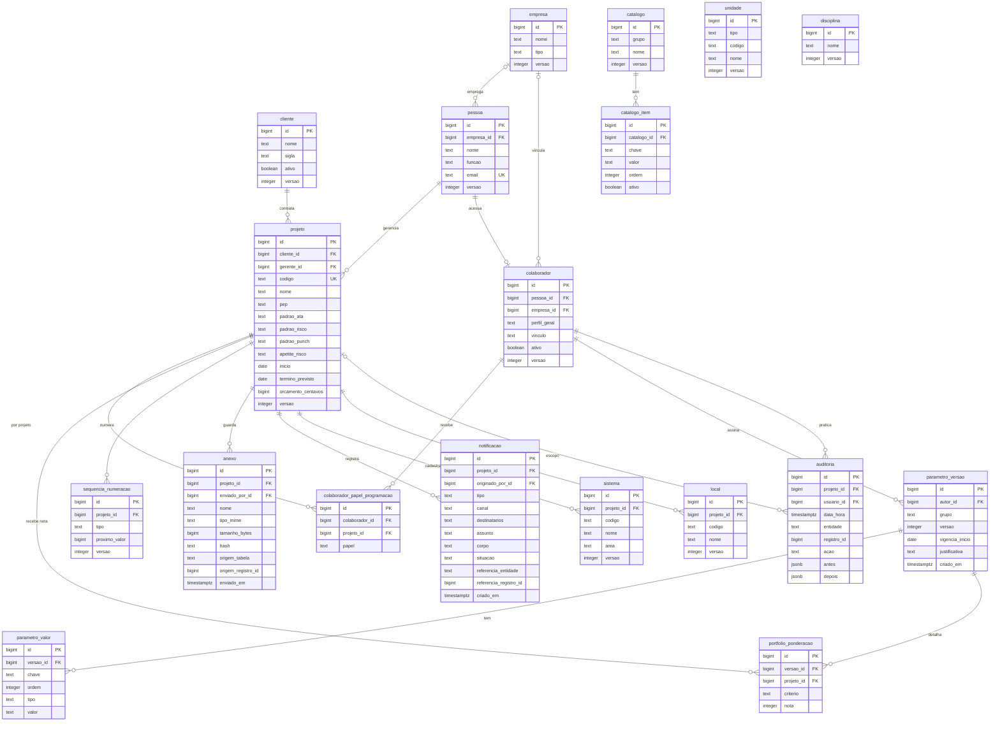
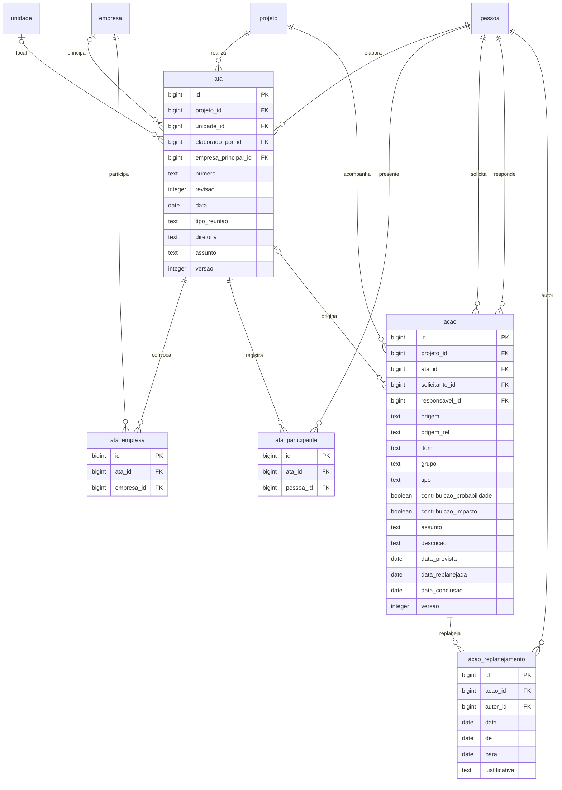
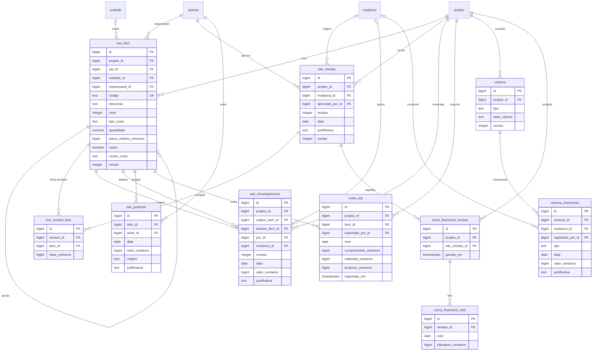

# Modelo de dados do Timenow GestNow

> **Parte 1 de 2.** Esta parte desenha a plataforma, os cadastros de apoio, a
> **01 Central de Ações**, a **08 Governança** e o **03 Financeiro**. A parte 2
> (ISSUE-004) completa o diagrama com **02 Planejamento**, **02 Programação
> Semanal**, **04 Suprimentos**, **05 Riscos**, **06 Qualidade**, **07 HSE**,
> análise do período e relatório.
>
> Estado: **aceito para execução** (decisão Q30). O dono do produto revisa o
> modelo no fim da execução; mudança depois disso vira issue nova.
>
> Regras da spec: D5 (uma tabela por entidade, nomes em português snake_case,
> chaves estrangeiras e restrições no banco, `projeto_id` em todo registro de
> projeto, `versao` em todo registro editável, centavos inteiros e datas em
> `date`), D5a (anexos), D5b (somente fatos, com exceções históricas), D7
> (colaborador, perfis e vínculo), D8 (escopo de projeto e Portfólio).
> Histórias atendidas: HU-152 e HU-154.

## Como ler este documento

* Os diagramas estão em **Mermaid** e renderizam no próprio Markdown. Cada
  entidade traz as colunas com **PK** (chave primária), **FK** (chave
  estrangeira) e **UK** (chave única). A cardinalidade segue a notação
  `||--o{` (um para muitos), `||--o|` (um para zero ou um) e `|o--o{` (zero ou
  um para muitos).
* Entidades referenciadas por outro diagrama ou desenhadas apenas na parte 2
  aparecem como caixas com o nome e sem colunas: as primeiras estão detalhadas
  em outro diagrama desta parte, as segundas estão listadas na seção
  [Chaves estrangeiras para a parte 2](#chaves-estrangeiras-para-a-parte-2).
* Depois dos diagramas, a seção [Tabelas](#tabelas) tem **uma linha por
  tabela** com o que ela guarda e o **módulo dono**. No fim está a
  [Tabela de cobertura](#tabela-de-cobertura-dos-mocks), que mapeia 100% das
  coleções dos mocks citados.

## Regras do desenho

1. **Uma tabela por entidade.** Nome de tabela e de coluna em português,
   snake_case, igual ao glossário do `CONTEXT.md` (`acao`, `medicao`,
   `projeto_id`, `data_prevista`).
2. **Chaves estrangeiras e restrições no banco.** Toda ligação desenhada tem
   FK e as unicidades de negócio estão anotadas (UK).
3. **`projeto_id` em todo registro de projeto.** Toda tabela com chave própria
   ligada a um projeto carrega `projeto_id`. Tabelas-filhas de um agregado
   (replanejamentos, participantes, itens do impacto, movimentos da reserva,
   notas da avaliação) não repetem a coluna: o projeto é o da raiz do
   agregado.
4. **`versao` em todo registro editável.** Tabelas com tela de edição ou com
   mudança de situação carregam `versao` (controle de edição simultânea da D5,
   recusa com 409). Ficam sem `versao`:
   * `auditoria` — tabela só de inclusão;
   * `parametro_versao`, `parametro_valor` e `portfolio_ponderacao` — cada
     alteração cria uma versão nova, nada é editado;
   * os fatos imutáveis de histórico: `acao_replanejamento`, `eac_revisao_item`,
     `eac_remanejamento`, `eac_projecao`, `custo_erp`, `reserva_movimento`,
     `curva_financeira_revisao`, `curva_financeira_mes`, `contrato_aditivo`,
     `licao_palavra_chave`, `licao_aplicacao`, `mudanca_impacto_eac_item`,
     `mudanca_remanejamento` e `mudanca_decisao_participante`;
   * as tabelas-filhas do agregado editáveis em conjunto (`ata_empresa`,
     `ata_participante`, `contrato_avaliacao_criterio`), protegidas pela
     `versao` da raiz.
5. **Somente fatos (D5b).** Nenhum indicador derivado vira coluna. Exceções
   históricas da D5b, anotadas na
   [seção própria](#exceções-da-d5b-gravadas): linha de base congelada de cada
   revisão da EAC e da Curva S financeira, e os pesos gravados na avaliação de
   contratada.
6. **Centavos inteiros e datas em `date`.** Todo valor financeiro é `bigint` em
   centavos; datas sem hora são `date`; carimbos técnicos são `timestamptz`.
7. **Módulo dono.** Um módulo lê ou grava tabela de outro somente pela fachada
   do dono (`service.py`), nunca direto (D5, D9).

## Diagramas

### 1. Plataforma e cadastros de apoio

### 2. 01 Central de Ações

### 3. 08 Governança

### 4. 03 Financeiro: EAC, reservas e curva financeira

### 5. 03 Financeiro: contratos

## Tabelas

### Plataforma e cadastros de apoio

| Tabela | O que guarda | Dono |
|---|---|---|
| `cliente` | Cliente do projeto (nome, sigla, ativo). | plataforma |
| `projeto` | Cadastro do projeto: código, nome, PEP, padrões de numeração (ata, risco, punch), gerente, apetite a risco, datas, orçamento aprovado em centavos. As notas da ponderação da carteira não ficam aqui: vão para `portfolio_ponderacao`. | configurações (cadastro), consumido por todos os módulos |
| `empresa` | Empresa contratada, fornecedor ou gerenciadora (nome e tipo). | configurações |
| `pessoa` | Pessoa do cadastro (nome, função, empresa e e-mail único de acesso). | configurações |
| `colaborador` | Pessoa com acesso: perfil geral (Visualizador, Membro, Gestor, Admin), vínculo (Timenow, Fornecedor, Cliente) e empresa (obrigatória no vínculo Fornecedor). O e-mail de acesso é `pessoa.email`. | configurações |
| `colaborador_papel_programacao` | Papel do colaborador na Programação Semanal por projeto (Planejador, Fiscal, Encarregado, Fornecedor); zero ou mais papéis por projeto. | configurações (cadastro), consumido por programação semanal |
| `parametro_versao` | Versão de um grupo de parâmetros: vigência, justificativa obrigatória, autor e data. Cada gravação cria uma versão; nada é editado. | configurações |
| `parametro_valor` | Valor de um parâmetro na versão, em linha tipada (`chave`, `tipo`, `valor`, `ordem` para listas). Cobre todos os grupos do protótipo (avaliação de contratadas, claims, HSE, riscos, financeiro, suprimentos, punch, mudanças, lições, produtividade, EAP, qualidade, portfólio). | configurações |
| `portfolio_ponderacao` | Nota de 1 a 5 de cada projeto por critério da carteira, dentro da versão de parâmetros do grupo portfólio; a edição da ponderação gera versão nova. | configurações |
| `sequencia_numeracao` | Próximo número por projeto e tipo (ata, SM, risco, RNC, punch, lição, claim, EOT...), com trava de linha na transação. | plataforma |
| `auditoria` | Trilha de auditoria **só de inclusão**: quem, quando, entidade, registro, ação e o antes/depois. Sem `versao`; a atualização e a exclusão são proibidas no banco. | plataforma |
| `anexo` | Metadados do arquivo (nome, tipo, tamanho, hash, autor, data) e o registro de origem (tabela + id). O arquivo fica na pasta local ou no Blob; o download checa a permissão do registro de origem (D5a). | plataforma |
| `notificacao` | Registro de envio (follow-up, pauta, tesouraria): destinatários, assunto, corpo, situação `simulado`/`enviado`/`erro` e referência ao registro. | plataforma |
| `sistema` | Cadastro de apoio de sistemas do projeto (código, nome, área); usado pelo punch list e pelas telas de planejamento. | configurações |
| `unidade` | Cadastro de apoio de unidades: de medida (m, un, Hh) ou organizacional (Unidade Horizonte), distinguidas por `tipo`. | configurações |
| `local` | Cadastro de apoio de locais do projeto (código, nome). | configurações |
| `disciplina` | Cadastro de apoio de disciplinas (Civil, Mecânica, Tubulação, Elétrica, Instrumentação, Automação, Arquitetura). | configurações |
| `catalogo` | Cadastro de apoio dos catálogos genéricos (tipo de reunião, diretoria, motivo de parada, categoria e afins), por grupo. | configurações |
| `catalogo_item` | Itens de cada catálogo (chave, valor, ordem, ativo). | configurações |

### 01 Central de Ações (dono: `central_acoes`)

| Tabela | O que guarda | Dono |
|---|---|---|
| `acao` | Ação de qualquer origem (Ata, Punch list, Contrato, Suprimentos, Risco, RNC, HSE, Mudança, Lição, Produtividade) e também a anotação da ata (`tipo = Informação`), com `item` e `grupo` de numeração. Guarda o código do registro de origem (`origem_ref`) e a FK da ata; o status (`Em andamento`, `Atrasada`, `Concluída`) **não é coluna**: é calculado na consulta. A contribuição ao plano de risco (probabilidade/impacto) são os dois booleanos. | central_acoes |
| `acao_replanejamento` | Cada replanejamento com data, de, para, autor e justificativa obrigatória; fato imutável, sem `versao`. | central_acoes |
| `ata` | Cabeçalho da reunião: número padrão do projeto, revisão, data, tipo, diretoria, unidade, elaborador, assunto e empresa principal. A **linhagem é o `numero`**: as revisões compartilham o número e se ordenam por `revisao` (UK projeto + número + revisão). | central_acoes |
| `ata_empresa` | Empresas executoras convocadas para a ata (com a principal marcada). Sem `versao` própria: a edição é protegida pela versão da ata. | central_acoes |
| `ata_participante` | Lista de presença por pessoa. A retirada é bloqueada no servidor quando há ação aberta sob responsabilidade do participante. Sem `versao` própria: a edição é protegida pela versão da ata. | central_acoes |

### 08 Governança (dono: `governanca`)

| Tabela | O que guarda | Dono |
|---|---|---|
| `mudanca` | Solicitação de mudança: código, tipo, origem, prioridade, solicitante, descrição, fonte do recurso, alçada efetiva (a mínima é calculada; o analista só eleva), situação, emergencial, marcos da implementação e a conferência do encerramento (cronograma, contrato, riscos, revisões incorporadas, observação e lição vinculada). | governanca |
| `mudanca_analise` | Análise em andamento: responsável, início, prazo e conclusão; cada reapresentação gera uma nova rodada. | governanca |
| `mudanca_impacto` | Análise de impacto obrigatória: custo (centavos, negativo para redução), prazo (dias no caminho crítico), escopo, qualidade, riscos, SMS, contrato, marco contratual e atividades; a versão vigente é a última. | governanca |
| `mudanca_impacto_eac_item` | Itens da EAC afetados pela análise, validados contra a EAC de nível 3. Sem `versao` própria. | governanca |
| `mudanca_remanejamento` | Transferência proposta entre itens da EAC (origem, destino, valor) e a sua aplicação: `aplicado`, data, autor e revisão da EAC. Aprovação aplica a transferência. Sem `versao` própria. | governanca |
| `mudanca_decisao` | Cada decisão registrada (data, resultado, condições, justificativa), inclusive as adiadas em `decisoesAnteriores`. | governanca |
| `mudanca_decisao_participante` | Participantes da decisão, para conferir o quórum. Sem `versao` própria. | governanca |
| `licao` | Lição aprendida com origem rastreável (`origem` + `origem_ref`), tipo (A repetir/A evitar), fase, área, disciplina, causa, impactos, recomendação, aplicabilidade (Projeto/Corporativa) e situação do fluxo. `reusos` não é coluna: é a contagem de `licao_aplicacao`. | governanca |
| `licao_palavra_chave` | Palavras-chave da lição, para a busca do acervo. Sem `versao` própria. | governanca |
| `licao_aplicacao` | Cada reuso registrado (projeto, data, como) e a ação da Central ou o risco gerados. Sem `versao` própria. | governanca |

### 03 Financeiro (dono: `financeiro`)

| Tabela | O que guarda | Dono |
|---|---|---|
| `eac_item` | Estrutura Analítica de Custos em três níveis (`pai_id` + `nivel`): descrição, tipo de custo, unidade, quantidade, preço unitário, CAPEX/OPEX, centro de custo e responsável. **Nenhum valor agregado é coluna**: base vem de `eac_revisao_item`, remanejamento de `eac_remanejamento`, comprometido/realizado dos fatos dos módulos donos, projeção de `eac_projecao`. UK: projeto + código. | financeiro |
| `eac_revisao` | Revisão da EAC (Rev 0 = linha de base) com data, justificativa, SM de origem e aprovador. O total não é coluna: é a soma de `eac_revisao_item.base_centavos`. UK: projeto + revisão. | financeiro |
| `eac_revisao_item` | Linha de base congelada de cada item em cada revisão, em centavos. **Exceção da D5b** (fato histórico): é o que permite comparar revisões. UK: revisão + item. Sem `versao`. | financeiro |
| `eac_remanejamento` | Remanejamento aplicado na EAC: item de origem, item de destino, valor, autor, SM e revisão. Fato imutável, sem `versao`. | financeiro |
| `eac_projecao` | Histórico da projeção no término por item: data, valor, autor, origem (manual ou ERP) e justificativa. A projeção vigente é a última linha; fato imutável, sem `versao`. | financeiro |
| `custo_erp` | Custos do ERP por item e mês (comprometido, realizado e projeção), com quem e quando importou. UK: item + mês. | financeiro |
| `reserva` | Reserva de contingência ou gerencial do projeto (uma linha por tipo), com a base de cálculo da constituição. O saldo não é coluna: é a soma dos movimentos. UK: projeto + tipo. | financeiro |
| `reserva_movimento` | Extrato da reserva: constituição, consumo por SM aprovada ou liberação, com valor, data, autor e justificativa. Fato imutável, sem `versao`. | financeiro |
| `curva_financeira_revisao` | Linha de base da Curva S financeira, congelada a partir de uma revisão da EAC. UK: projeto + revisão da EAC. Sem `versao`. | financeiro |
| `curva_financeira_mes` | Valor **planejado** em centavos por mês da revisão. **Exceção da D5b** (linha de base congelada). Comprometido, realizado e projeção da curva são calculados dos fatos. UK: revisão + mês. Sem `versao`. | financeiro |
| `contrato` | Administração contratual: número, contratada, objeto, modalidade, item da EAC e pacote de compra de origem, valor original, datas (original e vigente), gestor, fiscal, retenção e prazo de notificação de claim. Valor atual, medido e saldo são calculados. | financeiro |
| `contrato_aditivo` | Aditivo aprovado (valor e/ou dias), com motivo, SM e claim de origem. Fato imutável, sem `versao`. | financeiro |
| `contrato_medicao` | Boletim de medição: número, período (primeiro dia do mês), valor bruto, marco vinculado, situação do fluxo e motivo da devolução. Retenção e líquido são calculados pela retenção do contrato. | financeiro |
| `contrato_marco_pagamento` | Marco de pagamento: número, descrição, critério de aceite, percentual, datas e situação; a evidência obrigatória é um `anexo`. O valor em centavos não é coluna: é o percentual sobre o valor vigente do contrato. | financeiro |
| `contrato_claim` | Pleito (da contratada ou do contratante): causa, cláusula, datas do evento e da notificação, valores e dias pleiteados/reconhecidos, situação, risco e SM vinculados. Exposição e taxa de reconhecimento são calculadas. | financeiro |
| `contrato_extensao_prazo` | Extensão de prazo (EOT): claim de origem, evento, dias solicitados e concedidos, classificação, método de análise, marco afetado e decisão. | financeiro |
| `contrato_avaliacao` | Avaliação de desempenho (mensal ou final), com avaliador e a versão de parâmetros usada. A nota ponderada e a classe são calculadas. | financeiro |
| `contrato_avaliacao_criterio` | Peso e nota de cada critério **gravados na avaliação**. **Exceção da D5b** (fato histórico): a avaliação não muda quando os pesos mudam. UK: avaliação + critério. Sem `versao`. | financeiro |

## Exceções da D5b (gravadas)

A D5b manda gravar somente fatos e lista as exceções históricas. Nesta parte:

| Tabela | Exceção | Por que é fato |
|---|---|---|
| `eac_revisao_item` | Linha de base congelada da EAC por revisão. | O orçado de uma revisão não pode ser recalculado depois; é o histórico da revisão. |
| `curva_financeira_mes` | Linha de base congelada da Curva S financeira por revisão. | O planejado da revisão é a fotografia usada no relatório e no mapa de controle. |
| `contrato_avaliacao_criterio` | Pesos gravados na avaliação de contratada. | A avaliação tem de permanecer com os pesos vigentes na data em que foi feita. |

Nenhuma outra coluna desta parte guarda indicador derivado. Em especial, não
são colunas: o status da ação; o total da revisão da EAC; o orçado atual, o
saldo a comprometer e o desvio dos itens; o valor atual e o saldo a faturar do
contrato; o valor dos marcos de pagamento; a nota ponderada e a classe da
avaliação; o saldo da reserva; e as séries comprometido/realizado/projeção das
curvas.

## Chaves estrangeiras para a parte 2

Estas colunas apontam para tabelas desenhadas na parte 2 (ISSUE-004). O
diagrama desta parte mostra as entidades vazias correspondentes:

| Coluna | Tabela da parte 2 | Uso |
|---|---|---|
| `licao_aplicacao.risco_id` | `risco` (05 Riscos) | Risco gerado ao aplicar a lição. |
| `contrato_claim.risco_id` | `risco` (05 Riscos) | Claim vinculado a um risco. |
| `contrato.pacote_compra_id` | `pacote_compra` (04 Suprimentos) | Pacote adjudicado que originou o contrato. |

As demais referências entre módulos são por **código** (o `origem_ref` da ação,
o `origem_ref` da lição, o `referencia_registro_id` da notificação), conferidas
pela fachada do módulo dono dentro da transação (D9), porque um módulo não lê a
tabela do outro.

## Tabela de cobertura dos mocks

Conferência feita contra as chaves de `window.MOCK` dos arquivos
`data/mock-base.js`, `data/mock-config.js`, `data/mock-central.js`,
`data/mock-governanca.js`, `data/mock-financeiro.js` e a parte desta issue em
`data/mock-portfolio.js` (ver [Verificação](#verificação-das-coleções)).

### `mock-base` (6 coleções)

| Coleção | No protótipo | Destino no GestNow |
|---|---|---|
| `sessao` | Usuário, papel e pessoa da sessão demonstrativa. | `colaborador` + `pessoa` (o modo demonstração escolhe o perfil; não há tabela de sessão). |
| `clientes` | Cliente do projeto. | `cliente`. |
| `projetos` | Projetos do portfólio; `ponderacao` são as notas de 1 a 5 da carteira. | `projeto`; a `ponderacao` vai para `portfolio_ponderacao` (versão de parâmetros do grupo portfólio). |
| `projetoAtualId` | Escopo corrente no navegador (null = Portfólio). | Não persistido: parâmetro `projeto` na URL e cookie, resolvido pela plataforma (D8). |
| `empresas` | Empresas contratadas, fornecedores e gerenciadora. | `empresa`. |
| `pessoas` | Pessoas com função e empresa. | `pessoa`. |

### `mock-config` (2 coleções)

| Coleção | No protótipo | Destino no GestNow |
|---|---|---|
| `referencia` | Data de referência fixa do protótipo (25/09/2026). | Não persistido: `core.calendario` devolve a data de hoje no fuso do produto (D6). |
| `parametros` | Versão 1 e os 13 grupos de parâmetros (`avaliacaoContratada`, `claims`, `hse`, `riscos`, `financeiro`, `suprimentos`, `punch`, `mudancas`, `licoes`, `produtividade`, `eap`, `qualidade`, `portfolio`). | `parametro_versao` (uma linha por grupo e versão) + `parametro_valor` (cada valor, tipado); o grupo `portfolio` usa também `portfolio_ponderacao`. |

### `mock-central` (2 coleções)

| Coleção | No protótipo | Destino no GestNow |
|---|---|---|
| `atas` | Cabeçalho de cada revisão; linhagem pelo número; `empresasIds` e `participantesIds`. | `ata` (linhagem por `numero` + `revisao`), `ata_empresa`, `ata_participante`. |
| `acoes` | Ações de todas as origens e anotações (`tipo = Informação`), com `item`, `grupo`, `contribuicao` e `replanejamentos`. | `acao` (tipo, item, grupo e contribuição) + `acao_replanejamento`. |

### `mock-governanca` (2 coleções)

| Coleção | No protótipo | Destino no GestNow |
|---|---|---|
| `mudancas` | SM com `analise`, `impacto` (e itens da EAC), `decisao` e anteriores, `remanejamentos` e `remanejamentoAplicado`, `implementacao`, `encerramentoDetalhe` e `historico`. | `mudanca`; `mudanca_analise`; `mudanca_impacto` + `mudanca_impacto_eac_item`; `mudanca_remanejamento`; `mudanca_decisao` + `mudanca_decisao_participante`; marcos de implementação e encerramento em colunas de `mudanca`; `historico` na `auditoria`. |
| `licoes` | Acervo, `palavrasChave` e a contagem `reusos`. | `licao` + `licao_palavra_chave`; `reusos` é calculado de `licao_aplicacao`. |

### `mock-financeiro` (13 coleções)

| Coleção | No protótipo | Destino no GestNow |
|---|---|---|
| `eac` | Árvore de 3 níveis com `base`, `remanejamento`, `comprometido`, `realizado` e `projecao` por item. | `eac_item` (descrição/atributos); base → `eac_revisao_item`; remanejamento → `eac_remanejamento`; projeção → `eac_projecao`; comprometido/realizado → calculados dos pedidos, contratos e medições. |
| `eacRevisoes` | Revisões com total, justificativa, SM e aprovador. | `eac_revisao` (o total é a soma de `eac_revisao_item`). |
| `eacRemanejamentos` | Remanejamentos aplicados (origem, destino, valor, SM). | `eac_remanejamento`. |
| `reservas` | Reservas de contingência e gerencial com constituição e base. | `reserva` + `reserva_movimento` (a constituição é o primeiro movimento). |
| `curvaFinanceira` | Séries mensais planejado, comprometido, realizado e projeção. | `curva_financeira_revisao` + `curva_financeira_mes` (só o planejado, exceção da D5b); as demais séries são calculadas. |
| `contratos` | Contratos com valor original, datas, gestor, fiscal e retenção. | `contrato` (valor atual, medido e saldo são calculados). |
| `aditivos` | Aditivos com valor, dias, motivo, SM e claim. | `contrato_aditivo`. |
| `medicoes` | Boletins com período, bruto, situação e marco. | `contrato_medicao`. |
| `marcosPagamento` | Marcos com critério, percentual, valor, datas e situação. | `contrato_marco_pagamento` (o valor é o percentual sobre o valor vigente do contrato). |
| `claims` | Pleitos com direção, tipo, causa, valores, dias, situação, risco e SM. | `contrato_claim`. |
| `extensoesPrazo` | EOT com claim de origem, dias, classificação, método e decisão. | `contrato_extensao_prazo`. |
| `avaliacoes` | Avaliações com `pesos`, `notas` e comentário. | `contrato_avaliacao` + `contrato_avaliacao_criterio` (pesos gravados, exceção da D5b); nota ponderada e classe são calculadas. |
| `analisesPeriodo` | Análise do período por módulo, tipo e período, com desvios e comentários. | Tabela `analise_periodo` da **parte 2** (ISSUE-004), desenhada com o restante do módulo dono; nenhuma coleção fica sem destino. |

### `mock-portfolio` — parte desta issue

O `mock-portfolio` acrescenta registros dos projetos 2 e 3 às coleções dos
módulos. Para esta parte valem as 15 coleções abaixo; todas usam as **mesmas
tabelas** já mapeadas, com `projeto_id` 2 ou 3:

| Coleções | Destino no GestNow |
|---|---|
| `atas`, `acoes`, `mudancas`, `licoes` | `ata`/`ata_empresa`/`ata_participante`, `acao`/`acao_replanejamento`, `mudanca` e filhas, `licao` e filhas. |
| `eac`, `eacRevisoes`, `reservas`, `curvaFinanceira` | `eac_item`, `eac_revisao`/`eac_revisao_item`, `reserva`/`reserva_movimento`, `curva_financeira_revisao`/`curva_financeira_mes`. |
| `contratos`, `medicoes`, `marcosPagamento`, `claims`, `extensoesPrazo`, `avaliacoes` | `contrato` e filhas. |
| `analisesPeriodo` | `analise_periodo` da parte 2 (o Portfólio grava com `projeto_id` nulo). |

As demais coleções do `mock-portfolio` (`curvaFisica`, `avancoAreas`,
`sistemas`, `punch`, `lookahead`, `programacoes`, `produtividadeItens`,
`jornadasCampo`, `amostragens`, `paralisacoes`, `eap`, `eapRevisoes`, `pacotes`,
`pedidos`, `processos`, `riscos`, `rncs`, `itps`, `inspecoesQualidade`,
`auditorias`, `analisesRisco`, `relatos` e o derivado `histogramaMaoDeObra`)
pertencem à parte 2 e são cobertas pela ISSUE-004; `sistemas` usa a tabela
`sistema` já desenhada aqui.

## Verificação das coleções

A conferência foi feita por script sobre as chaves de `window.MOCK`, carregando
os mocks citados em Node com um `window` isolado:

| Arquivo | Coleções encontradas | Cobertas neste documento |
|---|---|---|
| `mock-base` | 6 (`sessao`, `clientes`, `projetos`, `projetoAtualId`, `empresas`, `pessoas`) | 6 |
| `mock-config` | 2 (`referencia`, `parametros`) | 2 |
| `mock-central` | 2 (`atas`, `acoes`) | 2 |
| `mock-governanca` | 2 (`mudancas`, `licoes`) | 2 |
| `mock-financeiro` | 13 (`eac`, `eacRevisoes`, `eacRemanejamentos`, `reservas`, `curvaFinanceira`, `contratos`, `aditivos`, `medicoes`, `marcosPagamento`, `claims`, `extensoesPrazo`, `avaliacoes`, `analisesPeriodo`) | 13 |
| `mock-portfolio` (parte desta issue) | 15 (`atas`, `acoes`, `mudancas`, `licoes`, `eac`, `eacRevisoes`, `reservas`, `curvaFinanceira`, `contratos`, `medicoes`, `marcosPagamento`, `claims`, `extensoesPrazo`, `avaliacoes`, `analisesPeriodo`) | 15 |

## Pendências da parte 2

A ISSUE-004 completa o diagrama com: EAP, medições, revisões e desdobramentos,
linha de base da curva física, relato do período, 6WLA, produtividade, punch
list, Programação Semanal, suprimentos, riscos, qualidade, HSE, `analise_periodo`
e `relato` do relatório gerencial. As regras desta parte valem para as tabelas
novas, e a cobertura passa a incluir todos os mocks.
