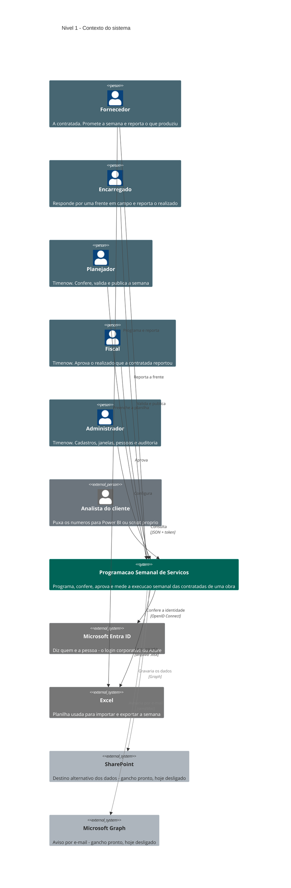
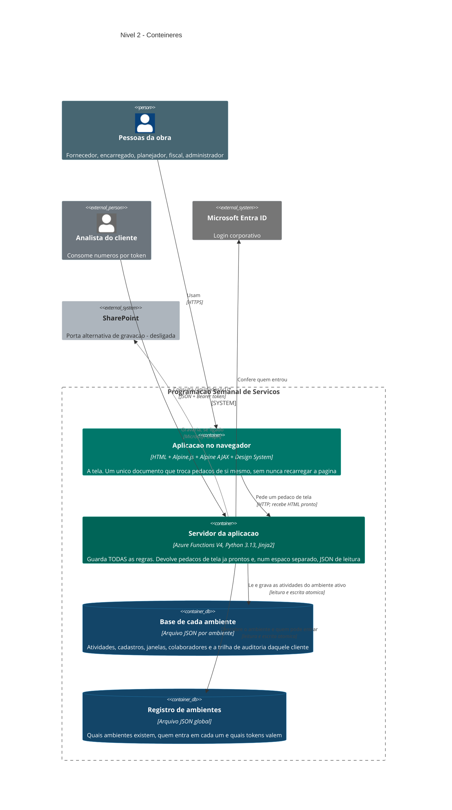
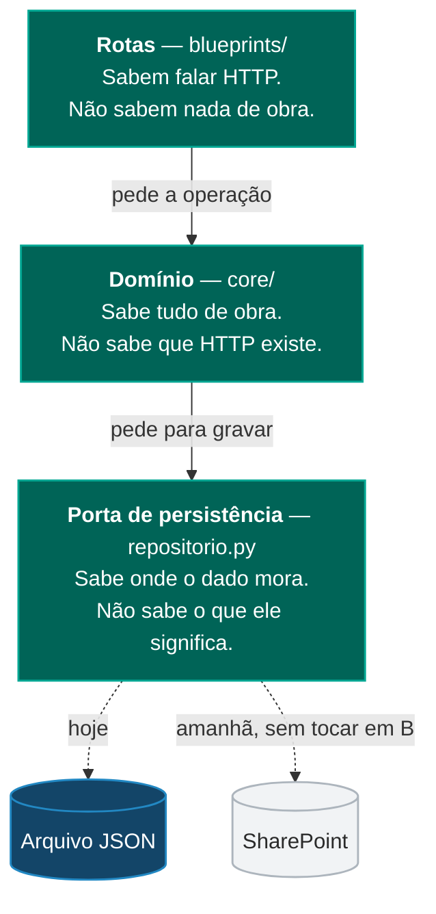
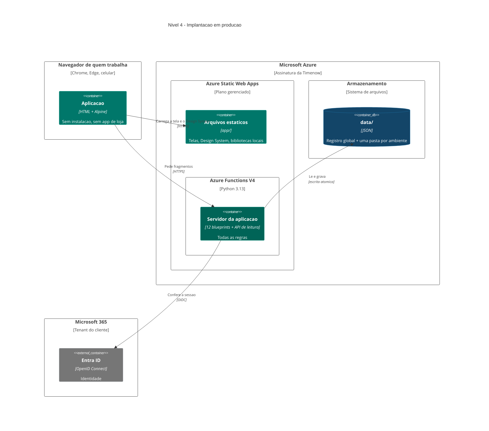
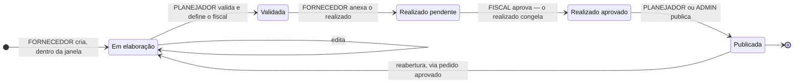
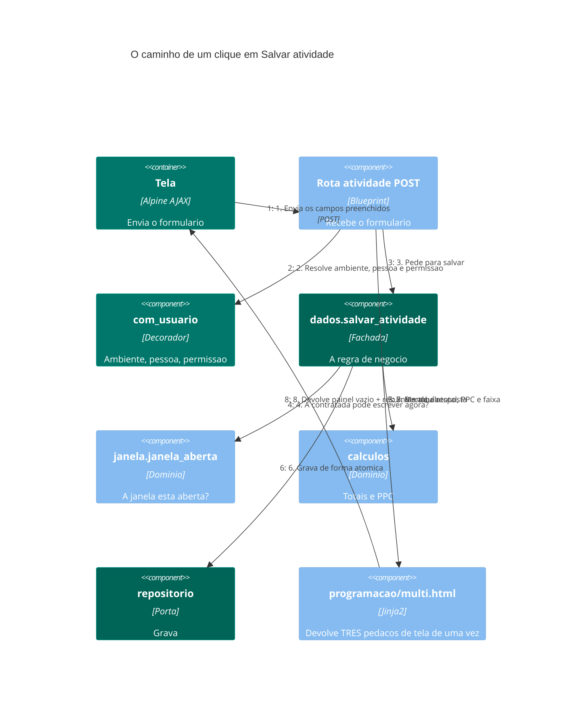
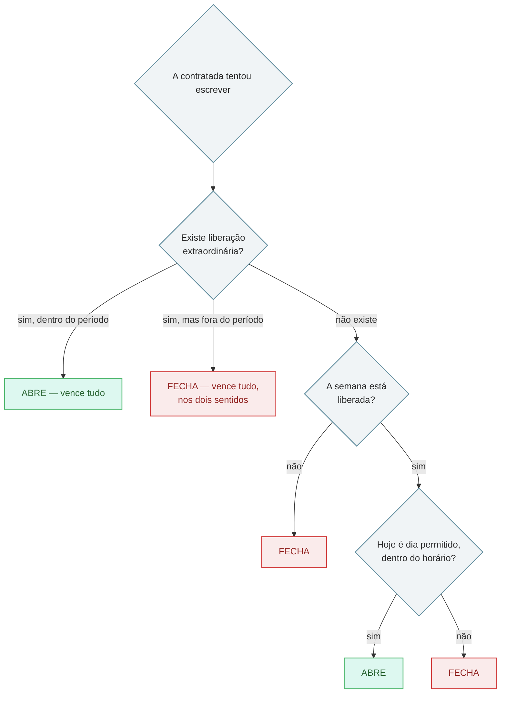

# Entenda o sistema — Programação Semanal de Serviços

**Para quem nunca abriu o código, e para quem escreve nele todo dia.**

Este documento explica o mesmo sistema quatro vezes, cada vez com um passo
a mais de detalhe. Você para no nível que responde à sua pergunta e fecha o
arquivo. Ninguém precisa ler tudo.

| Se você é… | Leia até | Tempo |
|---|---|---|
| Diretoria, cliente, alguém que só precisa saber "o que isso faz" | Níveis 1 e 2 | 5 min |
| Gerente de obra, planejador, fiscal, contratada | + "O que o sistema faz, tela a tela" | 15 min |
| Analista de dados do cliente | + "A API de leitura" | 20 min |
| Arquiteto, pessoa desenvolvedora | Tudo | 40 min |

---

## Como ler os diagramas

Os desenhos deste documento seguem o **modelo C4** — uma convenção criada
por Simon Brown para desenhar software do jeito que se usa um mapa: você dá
zoom até enxergar o que precisa, e não mais que isso.

São quatro níveis de zoom, e a analogia é literalmente cartográfica:

| Nível | O nome técnico | A analogia | Responde a pergunta |
|---|---|---|---|
| **1** | Contexto | O mapa do país | Com quem esse sistema conversa? |
| **2** | Contêineres | O mapa da cidade | De que peças grandes ele é feito? |
| **3** | Componentes | A planta do prédio | O que existe dentro de uma dessas peças? |
| **4** | Implantação | A foto de satélite | Onde isso tudo roda de verdade? |

E o vocabulário dos desenhos, em português claro:

| No diagrama aparece | Significa |
|---|---|
| Boneco | Uma **pessoa** — alguém que usa o sistema |
| Caixa azul-escuro | Uma peça **do nosso sistema** |
| Caixa cinza | Um sistema **de terceiros** — não somos nós que mantemos |
| Cilindro | Um lugar onde **dado fica guardado** |
| Seta | Alguém **conversa com** alguém. A seta aponta para quem recebe o pedido |
| Texto na seta | O que é dito, e por qual meio (HTTP, arquivo, e-mail…) |

> **Uma regra que vale para tudo aqui:** seta significa *"chama"*, não
> *"depende de"*. Se A aponta para B, é A quem toma a iniciativa.

---

## Em uma frase

> Uma obra tem várias empresas contratadas. Toda segunda-feira cada uma
> promete o quanto vai produzir de cada serviço, dia a dia. No fim da
> semana, diz o quanto produziu de verdade. **Este sistema é o lugar onde
> essa promessa é feita, conferida, aprovada e medida.**

O nome técnico da prática é *Last Planner System*. O indicador principal
chama-se **PPC** — Percentual do Plano Concluído. Traduzindo: *de tudo que
essa atividade prometeu para a semana, quanto saiu?*

---

## Glossário mínimo

Doze palavras. Com elas, o resto do documento se lê sozinho.

| Palavra | O que quer dizer, sem jargão |
|---|---|
| **Atividade** | Uma linha da programação. "Empresa X vai concretar 40 m³ nesta semana, assim distribuídos pelos dias" |
| **Semana** | Sempre escrita `S.30/2026`. Segue o calendário ISO e sempre começa numa segunda-feira |
| **Previsto** | O que foi prometido, espalhado pelos sete dias |
| **Realizado** | O que saiu de fato, separado em turno dia e turno noite |
| **PPC** | Realizado ÷ previsto **de uma atividade só**. O indicador do método |
| **Aderência** | Realizado ÷ previsto **de um conjunto** (a semana inteira, uma empresa, uma frente) |
| **Faixa** | A leitura do percentual em três cores: alta (≥ 80%), média (60–79%), baixa (< 60%) |
| **Frente** | Um pedaço da obra — a fundação, a estrutura, a terraplenagem |
| **Ambiente** | A "caixa" de dados de um cliente. Cada obra tem a sua, e elas não se enxergam |
| **Janela** | O período em que uma contratada tem permissão de escrever. Fora dela, ela só consulta |
| **Fragmento** | Um pedaço de tela pronto que o servidor devolve. Volta HTML, nunca dado cru |
| **Perfil** | O que a pessoa pode fazer. Seis deles, listados adiante |

**Cuidado com uma palavra:** neste projeto, *ambiente* significa a caixa de
dados de um cliente — **nunca** "ambiente de desenvolvimento/produção". Para
isso o projeto usa **implantação**.

---

## Nível 1 — Contexto: com quem o sistema conversa



> **Nota sobre estes diagramas.** O Mermaid aceita a **paleta** Timenow, mas
> não a tipografia, o raio, a elevação por borda nem o roteamento das setas —
> ele desenha linhas retas ponto-a-ponto, sem desvio de colisão. Por isso a
> versão apresentável destes mesmos oito diagramas é desenhada em SVG à mão,
> como o `ds/charts.js` já faz com os gráficos. Este `.md` continua sendo a
> fonte de verdade do conteúdo.

### O que cada caixa significa

| Caixa | Em português claro | Por que está no desenho |
|---|---|---|
| **Fornecedor** | A empresa contratada da obra | É quem alimenta o sistema. Sem ele não há programação |
| **Encarregado** | O líder de uma frente, em campo | Reporta o que a equipe dele produziu. Não programa, não valida |
| **Planejador** | O planejamento da Timenow | É quem diz "esta semana está boa" e a torna oficial |
| **Fiscal** | A fiscalização da Timenow | É quem confirma que o realizado reportado é verdade |
| **Administrador** | A gestão da Timenow | Mexe nos cadastros e em quem entra. Não interfere no fluxo |
| **Analista do cliente** | Alguém de fora, do lado do cliente | Não usa a tela. Puxa os números direto, com um token |
| **Entra ID** | O login da Microsoft que a empresa já usa | O sistema **não guarda senha de ninguém**. Ele pergunta ao Azure quem é você |
| **Excel** | A planilha de sempre | Obra roda em planilha. Ignorar isso seria arrogância de software |
| **SharePoint** e **Graph** | Duas portas prontas, hoje fechadas | Estão em cinza de propósito: o código existe, mas não está ligado |

**As duas linhas cinzas são a informação mais honesta deste diagrama.** Elas
dizem: *"isto foi previsto, está escrito, e não está funcionando ainda."*

---

## Nível 2 — Contêineres: de que peças o sistema é feito

Aqui damos um zoom na caixa azul do meio.



### O que cada caixa significa

| Caixa | Em português claro |
|---|---|
| **Aplicação no navegador** | A tela que você vê. É **um único arquivo HTML** que fica aberto o tempo todo; o que muda é o miolo dele |
| **Servidor da aplicação** | O cérebro. Toda decisão — quem pode o quê, se a conta fecha, se a janela está aberta — acontece aqui |
| **Base de cada ambiente** | Um arquivo por cliente. O da obra A não sabe que o da obra B existe |
| **Registro de ambientes** | O porteiro. Fica *acima* dos ambientes e sabe quais existem e quem entra em cada um |

### Três decisões que explicam o desenho inteiro

**1. O servidor devolve tela pronta, não dado cru.**
No jeito mais comum de fazer software web hoje, o servidor manda dados e o
navegador monta a tela. Aqui é o contrário: o servidor manda **HTML já
montado**, e o navegador só encaixa no lugar certo.

*Por que isso importa para quem não programa:* a tela não pode discordar do
servidor, porque ela não calcula nada. Não existe a situação clássica de
"na minha tela aparece um número, no relatório aparece outro".

**2. Não existe etapa de compilação.**
Sem bundler, sem build, sem CDN. Os arquivos que estão na pasta são
exatamente os que rodam. Quem abrir o projeto daqui a três anos consegue ler
o que está acontecendo.

**3. Existem duas portas de entrada, e elas são propositalmente diferentes.**

| | Porta da aplicação | Porta de leitura |
|---|---|---|
| Endereço | `/api/*` | `/api/dados/v1/*` |
| Quem usa | O navegador de quem trabalha na obra | Um Power BI, um script, um sistema do cliente |
| Credencial | A sessão do Azure (login corporativo) | Um **token** emitido para aquele ambiente |
| O que devolve | HTML pronto | JSON |
| Pode escrever? | Sim | **Não. Só leitura, sempre** |

O token *é* quem resolve o ambiente. Não há cookie, não há aba, não há como
um token de um cliente alcançar o dado de outro.

---

## Nível 3 — Componentes: o que existe dentro do servidor

O servidor tem três camadas, e a regra entre elas é rígida: **cada uma só
conversa com a de baixo.**

```mermaid
C4Component
  title Nivel 3 - Dentro do servidor da aplicacao

  Container(shell, "Aplicacao no navegador", "Alpine AJAX", "Pede pedacos de tela")
  Person_Ext(analista, "Analista do cliente", "Bearer token")

  Container_Boundary(api, "Servidor da aplicacao") {
    Component(blueprints, "Rotas - 12 blueprints", "Azure Functions", "Uma por assunto: programacao, atividades, dashboard, importacao, governanca, ambientes")
    Component(comum, "com_usuario", "Decorador Python", "O porteiro de toda rota: resolve o ambiente, resolve a pessoa, recusa o que o perfil nao pode")
    Component(dadosapi, "API de leitura", "Rotas JSON", "Espaco proprio, so GET, autenticado por token")
    Component(templates, "Templates Jinja2", "HTML", "Transformam o resultado em fragmento pronto para a tela")

    Component(facade, "dados.py - a fachada", "Python", "A porta unica do negocio. TODA transicao do fluxo passa por aqui")
    Component(rbacm, "rbac.py", "Python", "Quem pode o que. A matriz de perfis e permissoes")
    Component(janelam, "janela.py", "Python", "Quando cada contratada tem permissao de escrever")
    Component(calculos, "calculos.py", "Python", "PPC, aderencia, faixas, totais")
    Component(semanas, "semanas.py", "Python", "O UNICO lugar que faz conta de calendario")
    Component(indicadores, "indicadores.py", "Python", "Curva S, rankings, mapa de calor, gargalos")
    Component(planilha, "planilha.py", "Python + openpyxl", "Le a planilha conferindo linha a linha; exporta sete abas")
    Component(auth, "auth.py + registro.py", "Python", "Quem e a pessoa e a que ambientes ela tem acesso")

    Component(repo, "repositorio.py - a porta", "Python", "A unica costura entre o negocio e onde o dado mora")
  }

  ContainerDb(baseamb, "Base do ambiente", "JSON", "Hoje")
  System_Ext(sharepoint, "SharePoint", "Amanha")

  Rel(shell, blueprints, "Pede um fragmento", "HTTP")
  Rel(analista, dadosapi, "Consulta", "JSON")
  Rel(blueprints, comum, "Passa por")
  Rel(comum, auth, "Resolve ambiente e pessoa")
  Rel(comum, rbacm, "Pergunta se pode")
  Rel(blueprints, facade, "Pede a operacao de negocio")
  Rel(dadosapi, facade, "Le")
  Rel(facade, rbacm, "Confere a permissao da transicao")
  Rel(facade, janelam, "Confere se a janela esta aberta")
  Rel(facade, calculos, "Calcula PPC e totais")
  Rel(facade, semanas, "Converte semana em datas")
  Rel(facade, planilha, "Le e gera Excel")
  Rel(blueprints, indicadores, "Monta o painel")
  Rel(blueprints, templates, "Renderiza o fragmento")
  Rel(facade, repo, "Le e grava")
  Rel(repo, baseamb, "Hoje", "JSON atomico")
  Rel(repo, sharepoint, "Amanha", "Graph")

  UpdateRelStyle(repo, sharepoint, $lineColor="grey", $textColor="grey")
  UpdateLayoutConfig($c4ShapeInRow="4")

  UpdateElementStyle(shell, $bgColor="#00776A", $borderColor="#00A793", $fontColor="#ffffff")
  UpdateElementStyle(analista, $bgColor="#6C757D", $borderColor="#97B4BF", $fontColor="#ffffff")
  UpdateElementStyle(facade, $bgColor="#006457", $borderColor="#00A793", $fontColor="#ffffff")
  UpdateElementStyle(repo, $bgColor="#006457", $borderColor="#00A793", $fontColor="#ffffff")
  UpdateElementStyle(comum, $bgColor="#00776A", $borderColor="#00A793", $fontColor="#ffffff")
  UpdateElementStyle(baseamb, $bgColor="#134568", $borderColor="#2288C3", $fontColor="#ffffff")
  UpdateElementStyle(sharepoint, $bgColor="#ADB5BD", $borderColor="#DEE2E6", $fontColor="#2A2A2A")
```



### As três camadas, e por que a ordem não é negociável



**Por que isso vale a pena explicar para quem não programa:** essa separação
é o que permite trocar o SharePoint pelo arquivo JSON — ou o contrário —
**sem reabrir nenhuma regra de negócio**. A troca é o valor de uma variável
de configuração (`PROGRAMACAO_ORIGEM`). A regra de que a soma dos sete dias
precisa bater com o total continua escrita num lugar só, intocada.

### Componentes que merecem nome próprio

| Componente | O que faz, e por que é assim |
|---|---|
| **`dados.py` — a fachada** | Todo caminho passa por aqui. Nenhuma rota conversa com o arquivo direto. É o que garante que "publicar" signifique exatamente a mesma coisa vindo da tela, da planilha ou de um script |
| **`com_usuario` — o porteiro** | Um decorador no topo de cada rota. Faz sempre a mesma coisa, nesta ordem: **1)** o pedido veio mesmo da aplicação? **2)** de qual ambiente? **3)** quem é a pessoa? **4)** ela pode? Se a rota executa, as quatro respostas já são sim |
| **`semanas.py`** | O único módulo autorizado a fazer aritmética de data. Semana ISO tem armadilhas — a semana 1 é a que contém a primeira quinta-feira do ano, e há anos com 53 semanas. Concentrar isso num arquivo é o que impede o clássico "o relatório de dezembro sumiu" |
| **`repositorio.py` — a porta** | Uma classe abstrata com cerca de 15 métodos. Trocar de JSON para SharePoint é escrever outra implementação dela |
| **`registro.py`** | Vive *acima* dos ambientes. É dono do nome do projeto, do nome do cliente, de quem é membro e dos tokens de leitura. Tem trilha de auditoria própria |
| **`pii.py`** | Mascara e-mail de quem não tem permissão de ver dado pessoal. Pequeno, e presente desde o começo |

---

## Nível 4 — Implantação: onde isso roda



### O mesmo sistema, na máquina de quem desenvolve

| | Em produção | Na máquina local |
|---|---|---|
| Quem serve a tela | Azure Static Web Apps | `swa start`, ou um servidor Python equivalente |
| Quem diz quem você é | Entra ID (login da empresa) | **Modo demonstração** — entra pelo cadastro, com um seletor de perfil na barra lateral |
| Onde o dado mora | `data/` no Azure | `data/` na sua pasta |
| Como subir | Deploy do SWA | Dois cliques em `run.bat` |

O modo demonstração **desliga sozinho** assim que o Azure passa a autenticar.
Não é uma chave que alguém pode esquecer ligada: se existe sessão do Azure na
requisição, o modo demo não roda.

Na primeira execução local o sistema cria duas obras fictícias —
`demo-obra` e `demo-planta` — cada uma com seis semanas de histórico e duas à
frente, ancoradas na semana corrente. Assim toda tela tem número e todo
gráfico tem forma antes de qualquer pessoa digitar coisa alguma. Apagar
`data/` regenera tudo.

---

## O ciclo da semana

Esta é a parte que mais importa para quem opera. Uma atividade nasce, anda
por cinco estados e termina. **Cada passo tem um dono, e só ele move.**



### Quem move cada passo

| Passo | Quem faz | O que muda | Regra que o servidor confere |
|---|---|---|---|
| **Criar / editar** | Fornecedor (Timenow pode apoiar) | Nasce **em elaboração** | Só dentro da janela; ID não pode repetir na semana; a soma dos sete dias tem de bater com o total, com tolerância de 0,5 |
| **Validar** | Planejador | Vira **validada** e ganha um fiscal responsável | Só sai de "em elaboração" |
| **Anexar o realizado** | Fornecedor ou encarregado | Preenche turno dia e turno noite; a aprovação fica **pendente** | Precisa estar validada |
| **Aprovar o realizado** | Fiscal | Vira **aprovado**, e o realizado **congela** | Só o fiscal designado |
| **Publicar** | Planejador ou Administrador | Vira **publicada** e encerra a edição | — |
| **Reabrir** | Planejador ou Admin, a pedido | Volta a permitir edição | Precisa de um **pedido de alteração** aprovado |

> **Duas coisas diferentes que parecem uma só.**
> **Situação** é onde a programação está no fluxo (em elaboração / validada /
> publicada). **Aprovação do realizado** é outra régua (pendente / aprovado).
> Uma atividade publicada pode ter realizado pendente — e isso não é um bug.

### O que acontece quando alguém clica em "salvar"



Os passos 5 e 8 são os que mais surpreendem quem vem de outro sistema:

- **Passo 5 — total, PPC e aderência são sempre calculados, nunca digitados.**
  Não existe campo de total na tela. Não existe como salvar um PPC que não
  corresponda aos números.
- **Passo 8 — a resposta traz três pedaços de uma vez.** O painel lateral
  (que volta **vazio**, e vazio significa fechado), o resumo do topo e a
  tabela. Um clique, três partes da tela atualizadas, zero recarregamento.

---

## O que o sistema faz, tela a tela

Cada funcionalidade abaixo responde três perguntas: **o que é**, **para quem
serve** e **o que acontece nos bastidores**.

---

### Início

**O que é.** A primeira tela depois de escolher o ambiente. Um resumo do
estado da semana: aderência, PPC médio, o que espera decisão de alguém e o
que está travando.

**Para quem serve.** Para quem entra e tem trinta segundos. Responde
"preciso fazer alguma coisa agora?" sem obrigar ninguém a abrir a matriz.

**Nos bastidores.** A rota `home-resumo` monta o painel a partir das
atividades da semana já filtradas pelo escopo da pessoa. Um fornecedor vê o
resumo **da própria empresa** — o recorte é aplicado no servidor, não na
tela.

---

### Programação — a matriz

**O que é.** A tela central. Uma linha por atividade, com previsto e
realizado de cada um dos sete dias, e todas as ações do fluxo ao alcance.

**Para quem serve.** Para todo mundo, com botões diferentes: o fornecedor vê
"editar" e "reportar"; o planejador vê "validar" e "publicar"; o fiscal vê
"aprovar".

**Nos bastidores.**

- A tabela tem **sete colunas**, e os sete dias vivem dentro de uma delas
  como uma grade. A linha inteira cabe na tela: só existe rolagem vertical.
- Dentro da célula dos dias, duas linhas rotuladas `Prev` e `Real`. Os dois
  números têm o **mesmo tamanho de fonte, de propósito** — a comparação
  visual depende de os dígitos caírem alinhados na vertical.
- Formulários abrem num **painel que desliza pela direita**. Ele fecha
  porque o servidor devolve o painel vazio.
- As ações disponíveis vêm de `rbac.proxima_acao`: o servidor calcula qual é
  o próximo passo legítimo daquela atividade para aquela pessoa. **A tela
  esconde botão por conveniência; ela nunca decide acesso.**

**Ações do fluxo:** criar, editar, reportar realizado, validar, aprovar,
reabrir, publicar, excluir e **publicar a semana inteira** de uma vez.

---

### Dashboard

**O que é.** Os indicadores da obra ao longo do tempo, não só da semana.

**Para quem serve.** Gerência de obra, cliente, reunião semanal.

**O que tem lá:**

| Gráfico | O que mostra | Como ler |
|---|---|---|
| **Curva S** | O avanço físico acumulado | A curva prevista contra a realizada. Distância entre elas = atraso |
| **Previsto × realizado** | Barras por semana | Onde a promessa e a entrega se descolaram |
| **Distribuição por situação** | Quanto está em cada estado do fluxo | Muita coisa parada em "validada" = fiscal sobrecarregado |
| **Rankings** | Melhores e piores por empresa e por frente | Conversa de contrato |
| **Mapa de calor** | Dia da semana × frente | Revela padrão: "a frente 3 nunca produz na segunda" |
| **Turnos** | Dia contra noite | Se o turno da noite rende |
| **Gargalos** | Até 8 atividades que mais travam | A lista de o-que-resolver-primeiro |
| **Evolução por empresa** | A série de cada contratada | Se está melhorando ou piorando |

**Nos bastidores — dois detalhes que valem a leitura:**

1. **Os três gráficos com *drill*** agrupam por mês e abrem em semanas ao
   clique. O motor é um só (`ds/charts.js`); cada gráfico entra com um
   *adaptador* que diz como resumir um mês. E resumir **não é sempre somar**:
   barras de avanço somam; aderência divide a soma do realizado pela soma do
   previsto do período. Por isso o servidor manda **quantidade**, nunca
   percentual pronto.

2. **O avanço físico não é uma soma ingênua.** As unidades da obra não são
   somáveis entre si — kg de armação com m³ de solo não dá número nenhum. O
   avanço é medido **por atividade**, como fração do escopo dela no
   horizonte, com peso igual entre atividades. Isso está escrito na legenda
   do próprio gráfico, na tela, para ninguém interpretar errado.

Os gráficos são **SVG desenhados à mão** — sem biblioteca de terceiros, sem
CDN. Eles leem as cores dos tokens do Design System em tempo de execução.

---

### Importar planilha

**O que é.** O caminho de quem trabalha em Excel. Três passos: baixar o
modelo, subir a planilha preenchida, conferir e confirmar.

**Para quem serve.** Fornecedor com muitas atividades, e para a carga
inicial de uma obra.

**Nos bastidores — e este é o ponto:**

> **Nada grava antes da conferência.** A planilha sobe, o sistema lê linha a
> linha, mostra o que entendeu de cada uma e o que recusou, com o motivo. Só
> depois de você olhar essa lista é que existe um botão de confirmar.

O que a conferência checa, por linha: campos obrigatórios preenchidos;
valores que existem nos cadastros (local, empresa, unidade — comparados sem
acento e sem diferença de maiúsculas); quantidades numéricas; a soma dos
dias batendo com o total; e a ID exclusiva não repetindo na semana.

O modelo é gerado **para aquela semana e com os cadastros daquele ambiente**
— as listas de escolha já vêm preenchidas com o que existe. Não é um arquivo
genérico baixado de uma pasta.

---

### Governança

**O que é.** Duas coisas na mesma tela: o panorama por contratada e semana,
e a fila de pedidos de alteração.

**Para quem serve.** Planejamento e administração.

**Nos bastidores.**

- **O panorama:** uma linha por contratada e semana, com aderência e o
  estado das atividades. É a visão "quem está entregando".
- **A fila de pedidos:** quando algo já foi fechado para edição e precisa
  mudar, não se reabre no braço. Alguém **abre um pedido com um motivo**;
  quem tem a permissão `aplicar` decide. Aplicar reabre o item **e registra a
  decisão**.
- **A trilha de auditoria:** toda ação relevante vira uma linha — quem, o
  quê, quando, sobre qual atividade. Cada ambiente tem a trilha dele, e o
  registro global tem a sua.

O pedido de alteração é o mecanismo que permite ser rígido com o fluxo sem
ser burro: a exceção existe, tem dono, tem motivo escrito e fica registrada.

---

### Configurações

Quatro abas, com acessos diferentes:

| Aba | O que faz | Quem entra |
|---|---|---|
| **Geral** | Parâmetros do ambiente: semana padrão, horizonte, tolerâncias | Admin, planejador |
| **Cadastros de apoio** | As listas que alimentam os campos de escolha: locais, empresas, unidades de medida | Admin, planejador |
| **Janelas de programação** | Quando cada contratada pode escrever | Admin, planejador |
| **Colaboradores** | Quem tem acesso, com qual perfil e qual vínculo | **Só Administrador** |

**Por que Colaboradores é uma aba à parte e mais restrita.** O cadastro de
colaboradores é a **fonte de verdade do login**: um e-mail que não está ali
não entra, tenha ou não sessão do Azure. Quem mexe nessa lista mexe em quem
entra no sistema — e isso é uma responsabilidade diferente de trocar uma
unidade de medida.

**Uma escolha de design que evita um problema clássico:** as listas de
fiscais e encarregados **não são cadastros separados**. O formulário de
atividade oferece exatamente as pessoas que carregam esses perfis. Duas
listas das mesmas pessoas seriam duas listas para esquecer de atualizar — e
a que envelhece é sempre a que ninguém abre.

---

### A janela de programação

**O que é.** A regra que decide se uma contratada pode escrever *agora*.

**Para quem serve.** Para o planejamento. É o que impede a programação de
virar um documento que muda o tempo todo, sem deixar de permitir a exceção
legítima.

**Nos bastidores — três camadas, nesta ordem:**



O detalhe que costuma passar despercebido: a **liberação extraordinária
vence a regra nos dois sentidos**. Dentro do intervalo ela abre mesmo no dia
errado; fora dele ela fecha mesmo que a semana estivesse liberada. É uma
liberação *pontual*, não um "modo livre".

Fora da janela a contratada **não fica sem acesso** — ela consulta
normalmente. Só não escreve.

---

### Exportar

Três saídas, para três usos diferentes:

| Saída | Formato | Para quê |
|---|---|---|
| **Semana completa** | Excel, **sete abas** | Capa, programação, quebras por empresa e por frente, curva, diário. É o anexo de reunião |
| **Relatório** | Página feita para papel | Impressão e PDF. Tem folha de estilo própria |
| **Modelo de planilha** | Excel | O ponto de partida da importação, já com os cadastros do ambiente |

**Nos bastidores.** Os downloads são a única exceção à regra de que todo
endereço da aplicação só responde a pedidos vindos da tela. O motivo é
prosaico: o navegador pede um arquivo sem o cabeçalho da aplicação, e barrar
esses dois devolveria a tela no lugar da planilha.

---

### Ambientes — vários clientes, uma instalação

**O que é.** Cada cliente tem uma caixa de dados própria: sua programação,
seus cadastros, suas janelas, suas pessoas e sua trilha. **Sem nenhum ponto
de contato com as demais.**

**Para quem serve.** Para a Timenow atender várias obras sem manter várias
instalações do sistema — e sem risco de dado de um cliente aparecer para
outro.

**Nos bastidores.**

- **O seletor** é a primeira tela depois do login: uma caixa por ambiente a
  que você tem acesso.
- **O ambiente ativo** é resolvido a cada requisição. Fora dele, nenhum
  código toca a base: o sistema **falha fechado**, nunca cai num ambiente
  padrão.
- **A ordem importa e não é negociável:** o ambiente é resolvido **antes** da
  pessoa. O cadastro de colaboradores vive *dentro* de um ambiente —
  invertida, a ordem resolveria a pessoa contra o ambiente errado.
- **Aba velha é detectada.** Se você deixou uma aba aberta num ambiente e
  trocou em outra, o servidor percebe e recarrega a tela inteira — em vez de
  pintar a matriz do ambiente errado com a barra lateral nomeando outro.

**Quem administra os ambientes** é o **operador** — um papel global da
Timenow que **não vem do cadastro**. Ele vem da configuração da implantação
(`PROGRAMACAO_OPERADORES`). A razão é forte: o poder de enxergar todos os
clientes **não pode ser fabricado pelo dado**. Ninguém vira operador editando
um registro.

Operações do registro: criar ambiente, conceder e revogar acesso, emitir e
revogar tokens de leitura, arquivar e desarquivar, promover e rebaixar
operadores. Todas deixam linha na trilha do registro.

**Arquivar suspende sem revogar.** Um ambiente arquivado recusa acesso e
recusa token — mas desarquivar devolve a integração funcionando, sem
reemitir nada.

---

### A API de leitura

**O que é.** Um endereço JSON, só de leitura, para o cliente puxar os
próprios números para Power BI, script ou outro sistema.

**Para quem serve.** Para o analista de dados do lado do cliente.

**Como se usa:**

```bash
curl -H "Authorization: Bearer tn_xxx_yyy" https://SEU-HOST/api/dados/v1/resumo
```

| Endereço | Devolve |
|---|---|
| `/api/dados/v1/saude` | Se está no ar |
| `/api/dados/v1/ambiente` | Identificação do ambiente do token |
| `/api/dados/v1/atividades` | As atividades, com previsto e realizado |
| `/api/dados/v1/geral` | O consolidado |
| `/api/dados/v1/resumo` | Os indicadores já calculados |
| `/api/dados/v1/cadastros` | As listas de apoio |

**Nos bastidores — as garantias, e por que elas foram escritas assim:**

- **O token resolve o ambiente.** Não há cookie, não há cabeçalho de aba.
  Um token não alcança outro ambiente **porque não existe caminho para
  isso**, não porque uma verificação impede.
- **Só GET, sempre.** A porta de qualidade varre as rotas registradas e
  falha se alguém adicionar um verbo de escrita nesse espaço. É verificado,
  não confiado.
- **A palavra `dados` está no caminho de propósito**, para que nenhum
  endereço da aplicação caia nesse espaço sem sessão por acidente de nome.
- **Toda chamada deixa linha na trilha** — inclusive as recusadas, e o
  motivo da recusa vai junto.
- **A recusa é JSON legível**, nunca HTML, nunca um fragmento de tela.

---

## Quem pode o quê

Seis perfis. A tela esconde botão por conveniência; **quem decide acesso é
sempre o servidor**.

| Perfil | Em uma frase | Ver | Editar | Validar | Reportar | Aprovar | Publicar | Importar | Config. | Auditoria |
|---|---|:-:|:-:|:-:|:-:|:-:|:-:|:-:|:-:|:-:|
| **Administrador** | Acesso total, mais pessoas e auditoria | ✅ | ✅ | ✅ | ✅ | ✅ | ✅ | ✅ | ✅ | ✅ |
| **Planejador** | Valida, define o fiscal e publica | ✅ | ✅ | ✅ | — | — | ✅ | ✅ | ✅ | ✅ |
| **Fiscal** | Aprova o realizado sob sua responsabilidade | ✅ | ✅ | — | — | ✅ | — | — | ✅ | — |
| **Encarregado** | Responde pela frente em campo | ✅ | — | — | ✅ | — | — | — | — | — |
| **Fornecedor** | Programa e reporta a própria empresa | ✅ | ✅ | — | ✅ | — | — | — | — | — |
| **Visualizador** | Só leitura, com exportação | ✅ | — | — | — | — | — | — | — | — |

Além do perfil, existe o **vínculo** — o que a pessoa *enxerga*:

| Vínculo | Enxerga |
|---|---|
| `timenow` | Tudo, no ambiente ativo |
| `fornecedor` | **Só a própria empresa**, em toda tela, sempre |
| `cliente` | Tudo, no ambiente ativo |

**O recorte do fornecedor é aplicado no servidor**, na fachada, antes de a
tela existir. Não é um filtro de interface que alguém possa contornar
digitando um endereço.

E acima de tudo isso, fora da tabela de propósito, o **operador** — o papel
global que administra o registro de ambientes, com três permissões que
**nenhum perfil do cadastro possui**: gerir o registro, conceder acesso e
gerir tokens.

---

## Como os números são calculados

Nenhum destes é digitado. Todos são calculados a cada leitura.

| Número | A conta | O detalhe que muda tudo |
|---|---|---|
| **Total previsto** | Soma dos sete dias | Tem de bater com a produção prevista da semana, com tolerância de 0,5 |
| **Total realizado** | Soma dos sete dias, turno dia + turno noite | — |
| **PPC** | realizado ÷ previsto, **de uma atividade** | É o indicador do Last Planner. É *por atividade* |
| **Aderência** | soma do realizado ÷ soma do previsto **de um conjunto** | **Não é a média dos PPCs.** Aderência pondera pelo tamanho; a média de PPC, não |
| **Faixa** | alta ≥ 80% · média 60–79% · baixa < 60% | **Uma escala só** — usada pela tabela, pelos medidores, pelos gráficos e pela planilha exportada |
| **Avanço físico** | Por atividade, como fração do escopo no horizonte, peso igual | Unidades da obra não são somáveis entre si |

> **A diferença entre PPC médio e aderência é a que mais gera discussão em
> reunião.** Se uma contratada tem uma atividade de 1000 m³ com 50% e outra
> de 10 m³ com 100%, o PPC médio dá 75% e a aderência dá cerca de 50%. **A
> aderência está certa** — foi ela que percebeu que o volume que importava
> não saiu.

---

## O que garante que isso continue funcionando

**A porta de qualidade** (`node scripts/verificar.mjs`) roda cinco etapas
obrigatórias antes de qualquer entrega: formatação e regras do Python
(`ruff`), checagem de tipos (`ty`), regras de JavaScript, CSS e HTML
(ESLint) e o padrão Timenow.

Três regras da casa que valem citar porque explicam decisões que aparecem no
código:

1. **Nunca se desliga uma regra para o portão passar.** Se for falso positivo
   estrutural, ajusta-se a configuração **com comentário explicando por quê**.
   Os casos vivos estão documentados e são três.
2. **Nenhum valor fixo de cor, espaçamento, raio ou sombra.** Tudo por token
   do Design System. Os gráficos leem os tokens em tempo de execução pelo
   mesmo motivo.
3. **A falta de estilo falha alto.** Existe uma variável-sentinela conferida
   no boot: se o Design System não carregar, o app falha com mensagem visível
   em vez de servir uma tela sem estilo.

---

## O que está pronto e desligado

Honestidade é parte da documentação. Três coisas existem no código e **não
estão em uso**:

| O quê | Estado | O que falta |
|---|---|---|
| **SharePoint como base** | O mapa de listas e colunas está escrito | Só a aquisição de token, isolada em dois métodos. Enquanto não existir, a integração **recusa com uma mensagem dizendo o que configurar** — em vez de falhar com erro 500 no meio da tela |
| **Aviso por e-mail** | O envio pelo Microsoft Graph está escrito | Ninguém chama. Ficou fora porque *avisar automaticamente é decisão de processo, não de código* — e essa decisão ainda não foi tomada. Sem a variável `EMAIL_ATIVO`, o módulo registra o que enviaria e devolve sucesso |
| **Modo demonstração** | Ligado por padrão fora do Azure | Nada. Desliga sozinho quando há sessão do Azure |

---

## Onde continuar

| Se você quer… | Vá para |
|---|---|
| Operar o sistema, tela a tela | [COMO-USAR.md](COMO-USAR.md) |
| Entender cada termo do domínio | [CONTEXT.md](../CONTEXT.md) |
| Ver a arquitetura em detalhe técnico | [ARCHITECTURE.md](ARCHITECTURE.md) |
| Consumir a API de leitura | [API-DE-LEITURA.md](API-DE-LEITURA.md) |
| Achar um arquivo | [ONDE-ESTA.md](ONDE-ESTA.md) |
| Escrever código aqui | [PADRAO-DE-CODIGO.md](PADRAO-DE-CODIGO.md) |

---

*Documento levantado a partir do código em 28/08/2026. Diagramas no modelo
C4, em Mermaid — renderizam direto no GitHub, no VS Code e em qualquer
visualizador de Markdown com suporte a Mermaid.*
